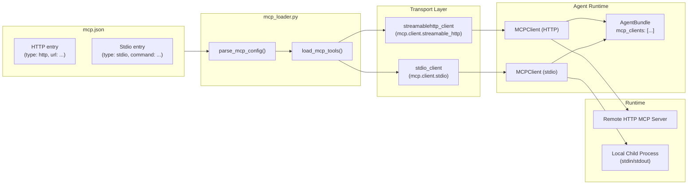
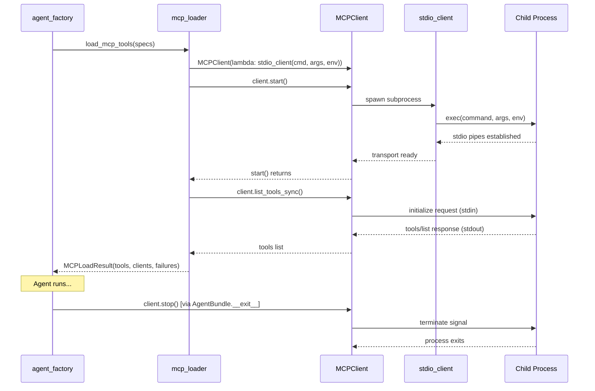

# Design Document

## Overview

This design extends the existing `mcp_loader.py` module to support stdio-based MCP servers alongside the current streamable-HTTP transport. Stdio MCP servers are local child processes that communicate with the MCP client over stdin/stdout pipes using the MCP stdio transport protocol.

The change is additive: the existing HTTP transport, soft-fail behavior, configuration structure, and `AgentBundle` lifecycle remain unchanged. The key modifications are:

1. **MCPServerSpec dataclass** gains optional `command`, `args`, and `env` fields for stdio entries.
2. **`parse_mcp_config`** validates and accepts `"type": "stdio"` entries with field-level size constraints.
3. **`load_mcp_tools`** constructs stdio `MCPClient` instances using `mcp.client.stdio.stdio_client` as the transport factory.
4. **`AgentBundle.__exit__`** already calls `client.stop()` on all clients — stdio clients terminate their child processes through this same path.

### Design Decisions

- **Single MCPServerSpec dataclass**: Rather than creating a separate `StdioMCPServerSpec` subclass, the existing `MCPServerSpec` is extended with optional stdio fields (`command`, `args`, `env`). The `transport` field discriminates between `"http"` and `"stdio"` at runtime. This keeps the `load_mcp_tools` interface unchanged and avoids a type hierarchy for two transport variants.
- **Validation at parse time**: All field-level constraints (command length, args count, env size) are enforced in `parse_mcp_config` so that `load_mcp_tools` can assume valid specs. This follows the existing pattern where `parse_mcp_config` raises `ConfigError` for invalid entries.
- **Reuse existing soft-fail pattern**: Stdio connection failures (command not found, permission denied, timeout) follow the identical soft-fail path as HTTP failures — log WARNING, write operator message, record in `MCPLoadResult.failures`, continue.
- **Child process cleanup via MCPClient.stop()**: The Strands `MCPClient` wrapping a stdio transport already handles process termination when `stop()` is called. The `AgentBundle.__exit__` method already iterates all clients and calls `stop()`, so no new cleanup code is needed in the agent factory.

## Architecture



### Lifecycle Sequence (stdio server)



## Components and Interfaces

### Modified: `MCPServerSpec` dataclass

```python
@dataclass(frozen=True)
class MCPServerSpec:
    """Specification for a single MCP server declared in mcp.json."""

    name: str           # e.g., "my-stdio-server"
    transport: str      # "http" or "stdio"
    disabled: bool

    # HTTP-specific fields
    url: str = ""       # Required for transport="http"

    # Stdio-specific fields
    command: str = ""   # Required for transport="stdio" (1-1024 chars after trim)
    args: tuple[str, ...] = ()    # Optional, max 64 elements, each max 4096 chars
    env: dict[str, str] = field(default_factory=dict)  # Optional, max 64 entries
```

**Rationale for `tuple` over `list` for args**: The dataclass is frozen, so `args` uses an immutable tuple. The `env` dict is acceptable because frozen dataclasses only prevent reassignment of the field, not mutation of the dict contents — but since specs are created once and never modified, this is safe.

### Modified: `parse_mcp_config`

The function gains a new branch for `"type": "stdio"` entries:

```python
def parse_mcp_config(path: Path) -> list[MCPServerSpec]:
    """Parse the MCP configuration file at *path*.

    Supports:
      - "type": "http" — requires "url" field (existing behavior)
      - "type": "stdio" — requires "command" field, optional "args" and "env"
      - "type": "sse" — raises ConfigError (unsupported)
      - Any other type — raises ConfigError (unrecognized)

    Validation for stdio entries:
      - "command": non-whitespace string, 1-1024 chars after trim
      - "args": array of strings, max 64 elements, each max 4096 chars
      - "env": object of string key-value pairs, max 64 entries,
               keys max 256 chars, values max 8192 chars
      - "url" field is silently ignored for stdio entries
      - "disabled": true skips the entry (after validation)

    Size limits are enforced even for disabled entries to catch config errors early.
    """
```

### Modified: `load_mcp_tools`

The function gains a transport-dispatch branch:

```python
def load_mcp_tools(
    specs: Sequence[MCPServerSpec],
    connect_timeout_seconds: int,
    operator_stream: IO[str] | None = None,
) -> MCPLoadResult:
    """Connect to each MCP server and retrieve its tools.

    For stdio specs:
      1. Build MCPClient with stdio_client transport factory.
      2. Call client.start() to spawn the child process.
      3. Call client.list_tools_sync() to retrieve tools.
      4. On failure during start(): record failure, continue.
      5. On failure during list_tools_sync(): call client.stop() first,
         then record failure, continue.

    For HTTP specs:
      (existing behavior unchanged)
    """
```

### Unchanged: `AgentBundle.__exit__`

The existing implementation already handles cleanup correctly:

```python
def __exit__(self, exc_type, exc, tb) -> None:
    """Close every MCPClient (best-effort)."""
    for client in self.mcp_clients:
        try:
            client.stop()
        except Exception:
            pass
```

For stdio clients, `client.stop()` terminates the child process. The Strands MCPClient implementation handles the graceful-then-forceful termination internally. The existing best-effort loop with exception swallowing satisfies R5.4 and R5.5.

### Configuration File Schema

Updated `mcp.json` example with both HTTP and stdio entries:

```json
{
  "mcpServers": {
    "aws-knowledge-mcp-server": {
      "type": "http",
      "url": "https://knowledge-mcp.global.api.aws"
    },
    "local-filesystem-server": {
      "type": "stdio",
      "command": "npx",
      "args": ["-y", "@modelcontextprotocol/server-filesystem", "/home/user/projects"],
      "env": {
        "NODE_ENV": "production"
      }
    },
    "disabled-server": {
      "type": "stdio",
      "command": "python",
      "args": ["-m", "my_mcp_server"],
      "disabled": true
    }
  }
}
```

### Error Messages

All `ConfigError` instances raised for stdio validation include the server entry key name and a descriptive message:

| Condition | Error message pattern |
|---|---|
| Missing/empty command | `"Server '{name}': 'command' must be a non-whitespace string between 1 and 1024 characters for stdio transport"` |
| Command too long | `"Server '{name}': 'command' must be a non-whitespace string between 1 and 1024 characters for stdio transport"` |
| args not an array | `"Server '{name}': 'args' must be an array of strings"` |
| args element not string | `"Server '{name}': 'args' must be an array of strings"` |
| args exceeds 64 elements | `"Server '{name}': 'args' exceeds maximum of 64 elements"` |
| args element exceeds 4096 chars | `"Server '{name}': 'args' element exceeds maximum of 4096 characters"` |
| env not an object | `"Server '{name}': 'env' must be an object of string key-value pairs"` |
| env key/value not string | `"Server '{name}': 'env' must be an object of string key-value pairs"` |
| env exceeds 64 entries | `"Server '{name}': 'env' exceeds maximum of 64 entries"` |
| env key exceeds 256 chars | `"Server '{name}': 'env' key exceeds maximum of 256 characters"` |
| env value exceeds 8192 chars | `"Server '{name}': 'env' value exceeds maximum of 8192 characters"` |
| type is "sse" | `"Server '{name}': SSE transport is unsupported"` |
| type is unrecognized | `"Server '{name}': unrecognized transport type '{type}'"` |

These errors are raised using a new `ConfigError` constructor pattern that accepts a descriptive message string directly, or by extending the existing `ConfigError` class. Since the current `ConfigError` takes a `knob` parameter, we'll use the `knob` field to carry the full descriptive message for stdio validation errors.

## Data Models

### MCPServerSpec (extended)

| Field | Type | Required | Default | Constraints |
|---|---|---|---|---|
| `name` | `str` | Yes | — | Server entry key from mcp.json |
| `transport` | `str` | Yes | — | `"http"` or `"stdio"` |
| `disabled` | `bool` | Yes | — | From config `"disabled"` field |
| `url` | `str` | For HTTP | `""` | Non-empty for HTTP transport |
| `command` | `str` | For stdio | `""` | 1-1024 chars after trim for stdio |
| `args` | `tuple[str, ...]` | No | `()` | Max 64 elements, each max 4096 chars |
| `env` | `dict[str, str]` | No | `{}` | Max 64 entries, keys max 256, values max 8192 |

### MCPLoadResult (unchanged)

| Field | Type | Description |
|---|---|---|
| `tools` | `list` | Strands-compatible tool wrappers from all successful servers |
| `clients` | `list` | Live MCPClient instances (both HTTP and stdio) |
| `failures` | `list[tuple[str, str]]` | `(server_name, error_message)` for each failed server |

### Configuration File Schema

```json
{
  "mcpServers": {
    "<server-name>": {
      "type": "http" | "stdio",
      "url": "<string>",           // Required for type=http
      "command": "<string>",       // Required for type=stdio (1-1024 chars)
      "args": ["<string>", ...],   // Optional for type=stdio (max 64, each max 4096)
      "env": { "<key>": "<val>" }, // Optional for type=stdio (max 64, keys max 256, vals max 8192)
      "disabled": true | false     // Optional, default false
    }
  }
}
```


## Correctness Properties

*A property is a characteristic or behavior that should hold true across all valid executions of a system — essentially, a formal statement about what the system should do. Properties serve as the bridge between human-readable specifications and machine-verifiable correctness guarantees.*

### Property 1: Valid stdio configuration round-trip

*For any* valid stdio server configuration entry (with a command string of 1–1024 non-whitespace characters, an args array of 0–64 strings each ≤ 4096 characters, and an env dict of 0–64 entries with keys 1–256 chars and values 0–8192 chars), `parse_mcp_config` SHALL return an `MCPServerSpec` with `transport="stdio"`, the exact `command` value, the `args` as a tuple matching the input array, and the `env` as a dict matching the input object. When `args` is absent, it defaults to an empty tuple; when `env` is absent, it defaults to an empty dict.

**Validates: Requirements 1.1, 1.2, 1.3, 2.1, 2.2**

### Property 2: Invalid stdio configuration rejection

*For any* stdio server configuration entry where the `command` field is missing, not a string, whitespace-only, empty, or exceeds 1024 characters after trimming, OR where `args` is not an array, contains non-string elements, exceeds 64 elements, or contains an element exceeding 4096 characters, OR where `env` is not an object, contains non-string keys or values, exceeds 64 entries, or has a key exceeding 256 characters or a value exceeding 8192 characters, `parse_mcp_config` SHALL raise a `ConfigError` whose message contains the server entry key name.

**Validates: Requirements 1.5, 1.8, 2.3, 2.4**

### Property 3: Unrecognized transport type rejection

*For any* MCP server configuration entry whose `type` field is a string that is not `"http"`, `"stdio"`, or `"sse"`, `parse_mcp_config` SHALL raise a `ConfigError` whose message contains the server entry key name and indicates the unrecognized transport type.

**Validates: Requirements 1.9, 2.7**

### Property 4: Stdio soft-fail invariant

*For any* exception class E (including `FileNotFoundError`, `PermissionError`, `OSError`, `TimeoutError`, `RuntimeError`, or any subclass of `Exception`) raised during `MCPClient.start()` or `MCPClient.list_tools_sync()` for a stdio server, `load_mcp_tools` SHALL NOT propagate the exception, SHALL record exactly one failure tuple `(server_name, "{E.__name__}: {message}")` in `MCPLoadResult.failures`, SHALL write exactly one warning line to the operator stream containing the server name, and SHALL NOT include the failed server's client in `MCPLoadResult.clients`. Additionally, if the exception occurs during `list_tools_sync()`, `client.stop()` SHALL be called before recording the failure.

**Validates: Requirements 4.1, 4.2, 4.3, 4.4, 3.5, 3.6**

### Property 5: Declaration order preservation

*For any* sequence of enabled MCP server entries (mix of HTTP and stdio) in the configuration file, `parse_mcp_config` SHALL return `MCPServerSpec` instances in the same order as the keys appear in the `mcpServers` object, and `load_mcp_tools` SHALL attempt connections in that same order, appending tools from each successful server to `MCPLoadResult.tools` in declaration order.

**Validates: Requirements 2.6, 3.4**

### Property 6: Cleanup completeness

*For any* sequence of MCPClient instances in `AgentBundle.mcp_clients` where zero or more clients raise exceptions when `stop()` is called, `AgentBundle.__exit__` SHALL call `stop()` on every client in the list, regardless of whether previous `stop()` calls raised exceptions.

**Validates: Requirements 5.1, 5.4, 5.5**

## Error Handling

### Parse-time errors (ConfigError)

All configuration validation errors are raised during `parse_mcp_config`, before any child processes are spawned. This ensures fast feedback for the Operator.

| Error condition | Raised by | Exit code |
|---|---|---|
| Missing/invalid command for stdio | `parse_mcp_config` | 3 (EXIT_CONFIG) |
| args type/size violation | `parse_mcp_config` | 3 (EXIT_CONFIG) |
| env type/size violation | `parse_mcp_config` | 3 (EXIT_CONFIG) |
| SSE transport requested | `parse_mcp_config` | 3 (EXIT_CONFIG) |
| Unrecognized transport type | `parse_mcp_config` | 3 (EXIT_CONFIG) |

### Runtime errors (soft-fail)

Connection failures during `load_mcp_tools` are handled gracefully:

| Error condition | Behavior |
|---|---|
| Command not found (`FileNotFoundError`) | Log WARNING, record failure, continue |
| Permission denied (`PermissionError`) | Log WARNING, record failure, continue |
| Process spawn failure (`OSError`) | Log WARNING, record failure, continue |
| Connection timeout (`TimeoutError`) | Log WARNING, record failure, continue |
| Server crash after start (`Exception` during `list_tools_sync`) | Call `stop()`, log WARNING, record failure, continue |

### Cleanup errors

| Error condition | Behavior |
|---|---|
| `stop()` raises on a client | Log WARNING (existing behavior), continue to next client |
| Child process already exited | `stop()` may raise `ProcessLookupError` — swallowed by existing try/except |

### Error message format

Soft-fail error messages follow the existing format: `"{ExceptionType}: {message}"`. This is consistent with the HTTP soft-fail format already in use.

## Testing Strategy

### Property-based tests (Hypothesis)

Property-based testing is appropriate for this feature because:
- The input space for configuration validation is large (strings of varying lengths, arrays of varying sizes, dicts with varying entries)
- Universal properties hold across all valid/invalid inputs
- Pure parsing logic with clear input/output behavior

**Library**: Hypothesis (already in dev dependencies, version >=6.0,<7.0)
**Minimum iterations**: 100 per property test

| Property | Test file | Strategy |
|---|---|---|
| Property 1: Valid stdio config round-trip | `tests/test_stdio_property1.py` | Generate random valid command/args/env within bounds, write to temp mcp.json, parse, verify MCPServerSpec fields |
| Property 2: Invalid stdio config rejection | `tests/test_stdio_property2.py` | Generate invalid command/args/env values exceeding bounds or wrong types, verify ConfigError raised with server name |
| Property 3: Unrecognized transport rejection | `tests/test_stdio_property3.py` | Generate random type strings ∉ {"http", "stdio", "sse"}, verify ConfigError |
| Property 4: Stdio soft-fail invariant | `tests/test_stdio_property4.py` | Generate random exception classes × failure steps, mock MCPClient, verify no propagation + failure recorded + cleanup |
| Property 5: Declaration order preservation | `tests/test_stdio_property5.py` | Generate random sequences of HTTP/stdio specs, verify output order matches input |
| Property 6: Cleanup completeness | `tests/test_stdio_property6.py` | Generate random client lists with some raising on stop(), verify all have stop() called |

**Tag format**: `Feature: stdio-mcp-transport, Property {N}: {title}`

### Unit tests (example-based)

| Test | Description |
|---|---|
| `test_stdio_entry_with_url_field_ignored` | Verify url field is silently ignored for stdio entries |
| `test_disabled_stdio_entry_skipped` | Verify disabled entries are excluded from parse output |
| `test_sse_type_raises_config_error` | Verify "sse" type raises ConfigError |
| `test_stdio_client_construction_uses_stdio_transport` | Mock MCPClient, verify stdio_client factory is used |
| `test_list_tools_failure_calls_stop` | Verify stop() is called when list_tools_sync() fails |
| `test_all_servers_fail_returns_empty_result` | Verify empty tools/clients when all fail |
| `test_mixed_http_stdio_tools_combined` | Verify tools from both transports appear in result |
| `test_exit_continues_after_stop_failure` | Verify __exit__ continues when one client.stop() raises |

### Integration tests

| Test | Description |
|---|---|
| `test_real_stdio_server_echo` | Spawn a simple echo MCP server, verify tools are loaded (requires test fixture server) |
| `test_nonexistent_command_soft_fails` | Use a command that doesn't exist, verify graceful failure |

### Test fixtures

A minimal test MCP server script (`tests/fixtures/echo_mcp_server.py`) that implements the MCP protocol over stdio for integration testing. This server exposes a single `echo` tool that returns its input.
