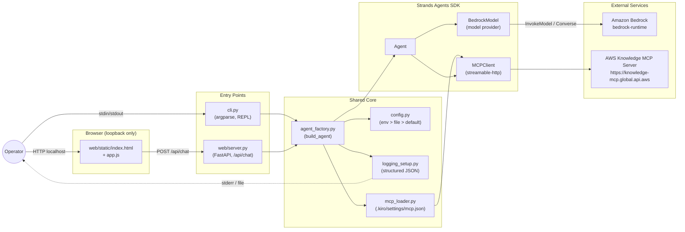
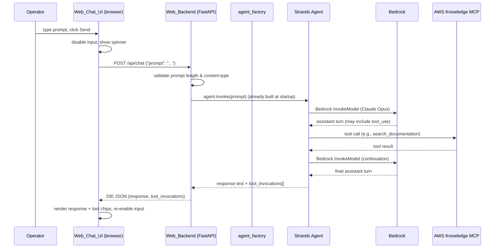

# Design Document

## Overview

This design specifies the implementation of `strands-bedrock-agent`: a runnable Python application that exposes a single Strands Agents SDK `Agent`, configured to use an Anthropic Claude Opus model on Amazon Bedrock as its sole LLM, and the AWS Knowledge MCP Server as its tool source. The Agent is reachable via two interchangeable entry points that share one factory:

1. A **CLI** for terminal use (single-prompt and interactive REPL modes) — satisfies Requirement 6.
2. A minimal **local Web UI + Backend** (FastAPI + a single static HTML/JS page) for browser-based testing — satisfies Requirement 9.

Both entry points construct the Agent through the same `agent_factory` module, so model resolution (R3), credentials/region resolution (R4), and MCP tool registration (R5) behave identically regardless of how the Operator interacts with the Agent.

### Architectural pillars

- **Single Agent construction path** (`agent_factory.build_agent`) reused by CLI and Web Backend. Guarantees consistent behaviour across surfaces (R9.6).
- **Layered configuration** (env var > config file > documented default) for model ID, region, log level, web port. Pure resolution logic, easy to test.
- **Soft-fail MCP integration**: connection failure logs a warning and continues with zero MCP tools, so the Agent still answers from the model alone (R5.5).
- **Hard-fail Bedrock configuration**: missing model/region or model unavailable in region terminates startup with a non-zero exit (R3.5, R3.6, R4.3, R4.6, R4.8).
- **Structured logging at every boundary** (config resolved, Bedrock invoke start/end, MCP connect, MCP tool start/end, agent error) with redaction at INFO+ levels (R7).

### Open clarification — Claude Opus model identifier

The user originally said "Claude Opus 4.6". As of the time of writing, both Claude Opus 4.5 and Claude Opus 4.6 exist on Amazon Bedrock:

- **Claude Opus 4.5**, base model ID `anthropic.claude-opus-4-5-20251101-v1:0`, US cross-region inference profile `us.anthropic.claude-opus-4-5-20251101-v1:0`. Source: [Bedrock model card](https://docs.aws.amazon.com/bedrock/latest/userguide/model-card-anthropic-claude-opus-4-5.html).
- **Claude Opus 4.6**, base model ID `anthropic.claude-opus-4-6-v1`, US cross-region inference profile `us.anthropic.claude-opus-4-6-v1`. Source: [Bedrock model card](https://docs.aws.amazon.com/bedrock/latest/userguide/model-card-anthropic-claude-opus-4-6.html).

Because Bedrock cross-region inference profiles are typically required (the `us.` / `eu.` / `global.` prefixed IDs) for tool-using agentic workloads in most regions, the **documented default** in this design is the US Geo cross-region inference profile for Opus 4.5:

```
us.anthropic.claude-opus-4-5-20251101-v1:0
```

The model identifier is configurable per R3.2 and can be swapped to Opus 4.6 (`us.anthropic.claude-opus-4-6-v1`) or any other Bedrock-served Claude variant by setting `BEDROCK_MODEL_ID`. The README will list both IDs explicitly. The exact default to ship with should be confirmed during code review (see Open Questions / Risks).

> Content was rephrased for compliance with licensing restrictions.

## Architecture



### Runtime sequence (web request)



## Components and Interfaces

### Project layout (R1.1, R1.7)

```
strands-bedrock-agent/
├── pyproject.toml                       # R1.1, R1.2, R1.3, R1.4, R6.1, R9.1
├── README.md                            # R1.1, R8.*
├── .gitignore                           # R1.7
├── .python-version                      # optional, pyenv hint: 3.10
├── .kiro/
│   └── settings/
│       └── mcp.json                     # R5.1
├── src/
│   └── strands_bedrock_agent/
│       ├── __init__.py                  # exposes __version__
│       ├── __main__.py                  # python -m strands_bedrock_agent (R6.1)
│       ├── config.py                    # R3.2, R3.3, R4.2, R7.2
│       ├── logging_setup.py             # R7.1, R7.2, R7.3, R7.4, R7.5
│       ├── mcp_loader.py                # R5.1, R5.2, R5.3, R5.5
│       ├── agent_factory.py             # R2.1, R2.2, R2.5, R2.6, R3.1, R3.4, R3.6
│       ├── errors.py                    # error taxonomy (see Error Handling)
│       ├── system_prompt.py             # the >=50-char system prompt (R2.2)
│       ├── cli.py                       # R6.*
│       └── web/
│           ├── __init__.py
│           ├── __main__.py              # python -m strands_bedrock_agent.web (R9.1)
│           ├── server.py                # FastAPI app, /api/chat (R9.2-R9.12)
│           ├── schemas.py               # Pydantic request/response models
│           └── static/
│               ├── index.html           # R9.2, R9.9
│               └── app.js               # R9.9, R9.10, R9.11
└── tests/
    ├── conftest.py                      # shared fixtures
    ├── test_config.py
    ├── test_logging_setup.py
    ├── test_mcp_loader.py
    ├── test_agent_factory.py
    ├── test_cli.py
    ├── test_web_server.py
    ├── test_properties.py               # Hypothesis property tests
    └── fixtures/
        └── mcp.json                     # test fixtures (NOT real creds)
```

The package name `strands_bedrock_agent` (importable) matches the spec name `strands-bedrock-agent` (PEP 503 normalized hyphen form). The console script names declared in `pyproject.toml` are:

- `strands-bedrock-agent` → `strands_bedrock_agent.cli:main` (satisfies R6.1)
- `strands-bedrock-agent-web` → `strands_bedrock_agent.web.server:main` (satisfies R9.1)

Both names are lowercase ASCII, contain only letters/digits/hyphens, are 1–64 chars, and do not start or end with a hyphen.

### Configuration model (R3.2, R3.3, R4.2, R7.2, R9.3, R9.5)

Single source of truth: a `Config` dataclass produced by `config.load_config()`. Precedence for every value: **CLI flag (where applicable) > environment variable > config file > documented default**. The only hard-required values that have no default are AWS credentials (resolved by boto3 default chain — R4.1) and AWS region (no documented default — R4.3 mandates failure if absent).

| Knob | Env var | CLI flag | Default | Accepted values | Required | Source |
|---|---|---|---|---|---|---|
| Bedrock model ID | `BEDROCK_MODEL_ID` | — | `us.anthropic.claude-opus-4-5-20251101-v1:0` | 1–256 char string | Yes (default supplies it) | R3.2 |
| AWS region | `AWS_REGION`, `AWS_DEFAULT_REGION` | — | none — must be set | matches `^[a-z]{2}-[a-z]+-\d$` | Yes | R3.3, R4.2, R4.3 |
| AWS profile | `AWS_PROFILE` | — | none (use default chain) | profile name in `~/.aws/config` | No | R4.4, R4.8 |
| Log level | `LOG_LEVEL` | — | `INFO` | DEBUG\|INFO\|WARNING\|ERROR\|CRITICAL (case-insensitive) | No | R7.2, R7.3 |
| MCP config path | `MCP_CONFIG_PATH` | — | `.kiro/settings/mcp.json` | path string | No | R5.1 |
| MCP connect timeout | `MCP_CONNECT_TIMEOUT_SECONDS` | — | `10` | positive int | No | R5.2 |
| MCP tool call timeout | `MCP_TOOL_TIMEOUT_SECONDS` | — | `30` | positive int | No | R5.4, R5.7 |
| Web port | `WEB_PORT` | `--port` | `8765` | int 1024–65535 | No | R9.2, R9.3, R9.4 |
| Web bind host | `WEB_HOST` | `--host` | `127.0.0.1` | only `127.0.0.1` unless `--allow-non-loopback` | No | R9.5 |
| Allow non-loopback bind | — | `--allow-non-loopback` | `false` | flag | No | R9.5 |
| Web request timeout | `WEB_REQUEST_TIMEOUT_SECONDS` | — | `120` | positive int | No | R9.10, R9.11 |
| Max prompt length | `MAX_PROMPT_LENGTH` | — | `10000` | positive int | No | R2.4, R6.3, R9.8 |

The default port `8765` is chosen as a documented default in the 1024–65535 range and is documented in the README (R9.13).

### Module: `config.py`

**Responsibility:** Load, validate, and freeze configuration from env + file. Pure (no I/O against AWS or MCP).

```python
# config.py
from dataclasses import dataclass
from pathlib import Path
from typing import Optional

DEFAULT_MODEL_ID: str = "us.anthropic.claude-opus-4-5-20251101-v1:0"
DEFAULT_LOG_LEVEL: str = "INFO"
DEFAULT_MCP_CONFIG_PATH: Path = Path(".kiro/settings/mcp.json")
DEFAULT_WEB_PORT: int = 8765
DEFAULT_WEB_HOST: str = "127.0.0.1"
DEFAULT_MAX_PROMPT_LENGTH: int = 10000
DEFAULT_MCP_CONNECT_TIMEOUT: int = 10
DEFAULT_MCP_TOOL_TIMEOUT: int = 30
DEFAULT_WEB_REQUEST_TIMEOUT: int = 120

VALID_LOG_LEVELS = {"DEBUG", "INFO", "WARNING", "ERROR", "CRITICAL"}
AWS_REGION_RE = r"^[a-z]{2}-[a-z]+-\d+$"


@dataclass(frozen=True)
class Config:
    bedrock_model_id: str
    aws_region: str
    aws_profile: Optional[str]
    log_level: str
    mcp_config_path: Path
    mcp_connect_timeout: int
    mcp_tool_timeout: int
    web_port: int
    web_host: str
    allow_non_loopback: bool
    web_request_timeout: int
    max_prompt_length: int
    # Diagnostic: which sources contributed (for error messages, R3.5)
    region_sources_checked: tuple[str, ...]
    log_level_was_invalid: bool   # if True, logging_setup must emit a WARNING (R7.3)


def load_config(
    *,
    cli_overrides: Optional[dict] = None,
    env: Optional[dict] = None,
    file_path: Optional[Path] = None,
) -> Config:
    """Resolve configuration with precedence: CLI > env > file > default.

    Raises:
        ConfigError: if required values are unresolvable (e.g., region missing).
    """
```

**Key behaviours:**

- `aws_region` resolution order: `cli_overrides["region"]` → `env["AWS_REGION"]` → `env["AWS_DEFAULT_REGION"]` → boto3 profile region (looked up via `botocore.session.Session(profile=...)`). On miss, raise `ConfigError("aws_region", checked=[...])` (R4.3).
- Invalid `LOG_LEVEL` does **not** raise; it sets `log_level="INFO"` and `log_level_was_invalid=True` so `logging_setup` can emit one WARNING (R7.3).
- The function never reads or returns AWS credentials — those stay inside boto3's default chain (R4.5).

### Module: `logging_setup.py`

**Responsibility:** Configure the root logger to emit single-line structured JSON records to stderr.

```python
# logging_setup.py
import logging
from typing import Any

EVENT_CONFIG_RESOLVED = "config.resolved"
EVENT_BEDROCK_INVOKE_START = "bedrock.invoke.start"
EVENT_BEDROCK_INVOKE_END = "bedrock.invoke.end"
EVENT_BEDROCK_RETRY = "bedrock.retry"
EVENT_MCP_CONNECT = "mcp.connect"
EVENT_MCP_TOOL_START = "mcp.tool.start"
EVENT_MCP_TOOL_END = "mcp.tool.end"
EVENT_AGENT_ERROR = "agent.error"

PROMPT_TRUNCATION_LIMIT = 4096


def configure_logging(level: str, log_level_was_invalid: bool) -> None:
    """Install a JSON formatter on the root logger and emit a startup warning
    if the operator set LOG_LEVEL to an invalid value (R7.3)."""


def log_event(logger: logging.Logger, level: int, event: str, **fields: Any) -> None:
    """Emit a structured record. At INFO+ levels, fields named ``prompt``,
    ``tool_args``, ``tool_result`` are replaced by ``<name>_bytes`` (R7.5).
    At DEBUG, large fields are truncated at 4096 chars with a marker (R7.4)."""
```

**Record shape (JSON, one per line):**

```json
{"ts":"2025-04-01T12:34:56.789012+00:00","level":"INFO","event":"bedrock.invoke.start",
 "logger":"strands_bedrock_agent.agent_factory","model_id":"us.anthropic.claude-opus-4-5-20251101-v1:0",
 "region":"us-west-2","prompt_bytes":42}
```

The formatter uses `datetime.now(timezone.utc).isoformat()` for the `ts` field (R7.1 ISO 8601 requirement).

### Module: `mcp_loader.py`

**Responsibility:** Parse `.kiro/settings/mcp.json`, build a `MCPClient` per declared server, attempt connection within `mcp_connect_timeout`, return the list of registered tools. On failure: log + emit operator-visible warning + return zero tools (R5.5).

```python
# mcp_loader.py
from dataclasses import dataclass
from pathlib import Path
from typing import Sequence

@dataclass(frozen=True)
class MCPServerSpec:
    name: str          # e.g., "aws-knowledge-mcp-server"
    url: str           # e.g., "https://knowledge-mcp.global.api.aws"
    transport: str     # "http" (streamable HTTP) — see R5.1
    disabled: bool


@dataclass
class MCPLoadResult:
    tools: list  # list of Strands tools (each compatible with Agent(tools=...))
    clients: list  # list of MCPClient instances kept alive for the Agent's lifetime
    failures: list[tuple[str, str]]   # [(server_name, error_message)]


def parse_mcp_config(path: Path) -> list[MCPServerSpec]:
    """Parse the JSON at ``path``. Raises ConfigError if file missing/invalid."""


def load_mcp_tools(
    specs: Sequence[MCPServerSpec],
    connect_timeout_seconds: int,
    operator_stream,                  # typically sys.stderr (R5.5 operator message)
) -> MCPLoadResult:
    """For each enabled spec: create MCPClient with streamable-http transport,
    connect within ``connect_timeout_seconds``, list_tools, return the joined list.
    On per-server failure: log WARNING with endpoint + error, write one operator
    line to ``operator_stream`` ("AWS documentation tools unavailable for this
    session"), and continue with that server contributing zero tools (R5.5)."""
```

**Connection mechanics:**

The Strands Agents Python SDK exposes an `MCPClient` plus official transport adapters. For a streamable-HTTP MCP server (which AWS Knowledge MCP is — confirmed from `awslabs/mcp/src/aws-knowledge-mcp-server/README.md`), the canonical pattern is:

```python
from mcp.client.streamable_http import streamablehttp_client
from strands.tools.mcp import MCPClient

client = MCPClient(lambda: streamablehttp_client(url=spec.url))
client.start()                             # opens the session
tools = client.list_tools_sync()           # returns Strands-compatible tool wrappers
# `client` must remain alive (kept in MCPLoadResult.clients) for the Agent lifetime;
# tool calls are routed through the live session.
```

If `client.start()` does not return within `connect_timeout_seconds`, the loader cancels and treats the server as failed.

### Module: `agent_factory.py`

**Responsibility:** Single function that ties everything together and returns a fully-constructed Strands `Agent` plus the cleanup handle for MCP clients.

```python
# agent_factory.py
from contextlib import AbstractContextManager
from dataclasses import dataclass
from typing import Optional

from .config import Config

@dataclass
class AgentBundle(AbstractContextManager):
    agent: "strands.Agent"
    mcp_clients: list                    # MCPClient instances to close on exit
    registered_tool_names: list[str]
    mcp_failures: list[tuple[str, str]]  # for diagnostics / web /api/chat metadata

    def __exit__(self, exc_type, exc, tb) -> None: ...


def build_agent(config: Config) -> AgentBundle:
    """Construct the Agent.

    Order of operations (each step satisfies a requirement):
      1. Resolve Bedrock model ID and region (R3.2, R3.3 — already in Config).
      2. Verify model availability in region via bedrock-control-plane
         ListFoundationModels / GetFoundationModel (R3.6). Fail-fast on miss.
      3. Construct strands.models.bedrock.BedrockModel(model_id=..., region_name=...,
         boto_session=boto3.Session(profile_name=config.aws_profile)) (R3.1, R4.4).
      4. Load MCP tools via mcp_loader (R5.2, R5.3, R5.5).
      5. Construct strands.Agent(model=..., tools=mcp_tools, system_prompt=...) (R2.1, R2.2, R2.5).
      6. Return AgentBundle.

    Raises:
        ConfigError: missing model id/region (R3.5).
        ModelUnavailableError: Bedrock model not enabled in region (R3.6).
        CredentialsError: boto3 cannot resolve credentials (R4.6, R4.8).
        StrandsCompatError: SDK class/method missing or signature mismatch (R2.7).
    """
```

**Step 2 — model availability precondition (R3.6):**
The factory makes a single best-effort `bedrock` (control-plane, *not* `bedrock-runtime`) `list_foundation_models` call filtered by provider Anthropic, then matches by `modelId` prefix; for cross-region inference profiles (those starting with `us.`, `eu.`, `global.`) it instead calls `list_inference_profiles` and matches by `inferenceProfileId`. On miss, it raises `ModelUnavailableError(model_id, region, hint="aws bedrock list-foundation-models --region " + region)`.

**Step 5 — system prompt:**
Defined as a constant in `system_prompt.py`. Must be at least 50 characters and explicitly instruct the Agent to invoke AWS Knowledge MCP tools when the user prompt mentions AWS services, APIs, documentation, or error messages (R2.2). Sample text (>50 chars):

> *"You are an AWS expert assistant. When the user asks about an AWS service, AWS API, AWS documentation, or an AWS error message, you MUST invoke the AWS Knowledge MCP tools (search_documentation, read_documentation, recommend) to ground your answer in current AWS documentation. Always cite the documentation URL you used."*

**Step 6 — tool registration verification (R2.5, R2.6):**
After Agent construction, the factory asserts that `set(agent.tool_registry.tool_names) >= set(expected_tools_from_mcp)`. If MCP soft-failed (zero tools), `expected_tools_from_mcp` is also empty so the assertion still holds. If MCP succeeded but registration silently dropped a tool, the factory raises `ToolRegistrationError(missing=[...])` and startup fails (R2.6).

### Module: `cli.py`

```python
# cli.py
import argparse
import sys

EXIT_OK = 0
EXIT_USAGE = 2
EXIT_CONFIG = 3
EXIT_CREDENTIALS = 4
EXIT_MODEL_UNAVAILABLE = 5
EXIT_AGENT_ERROR = 6


def build_arg_parser() -> argparse.ArgumentParser: ...


def main(argv: list[str] | None = None) -> int:
    """Entry point declared as console_script `strands-bedrock-agent` (R6.1).

    --prompt TEXT    Single-prompt mode: process once, print to stdout, exit (R6.2).
    --help / -h      Print usage to stdout and exit 0 (R6.5).
    (no args)        Interactive REPL: read one line per prompt, print response,
                     until ``exit``, ``quit``, or EOF (R6.4).
    """
```

**Argparse layout:**

```text
strands-bedrock-agent [-h] [--prompt PROMPT] [--log-level LEVEL]

  -h, --help          Show this message and exit
  --prompt PROMPT     Single prompt to send (1-10000 chars). If omitted, runs in
                      interactive mode reading one prompt per line from stdin.
  --log-level LEVEL   Override LOG_LEVEL (DEBUG/INFO/WARNING/ERROR/CRITICAL)
```

**Prompt validation (R2.4, R6.3):** Before invoking the Agent, CLI strips trailing newline, then enforces `1 <= len(stripped) <= max_prompt_length` and rejects whitespace-only prompts. On rejection: print error to stderr, exit non-zero (single-prompt) or print error and re-prompt (interactive — R6.8).

**Progress indicator (R6.6):** A daemon thread writes a rotating-spinner character to stderr every 1.0 seconds while the Agent is processing in interactive mode; the thread is signalled to stop when the Agent returns.

**Exit codes:** `0` success; `2` usage error from argparse / invalid prompt length; `3` config error (R3.5, R4.3); `4` credentials error (R4.6, R4.8); `5` model unavailable (R3.6); `6` unhandled agent error in single-prompt mode (R6.7); `7` Bedrock retries exhausted (R7.7).

### Module: `web/server.py`

**Responsibility:** FastAPI app that serves `index.html` at `/`, static assets under `/static/`, and `POST /api/chat`. Built once at startup, the Agent and MCP clients live in `app.state` for the process lifetime.

```python
# web/server.py
from contextlib import asynccontextmanager
from fastapi import FastAPI, HTTPException, Request
from fastapi.responses import JSONResponse, FileResponse
from fastapi.staticfiles import StaticFiles

from .schemas import ChatRequest, ChatResponse, ToolInvocation, ErrorResponse
from ..agent_factory import AgentBundle, build_agent
from ..config import load_config


@asynccontextmanager
async def lifespan(app: FastAPI):
    config = load_config()
    bundle = build_agent(config)         # R9.6: identical to CLI path
    app.state.bundle = bundle
    app.state.config = config
    try:
        yield
    finally:
        bundle.__exit__(None, None, None)


app = FastAPI(lifespan=lifespan, title="strands-bedrock-agent")
app.mount("/static", StaticFiles(directory="src/strands_bedrock_agent/web/static"), name="static")


@app.get("/", response_class=FileResponse)
async def index() -> FileResponse: ...


@app.post("/api/chat", response_model=ChatResponse, responses={400: {"model": ErrorResponse}, 500: {"model": ErrorResponse}})
async def chat(req: ChatRequest, request: Request) -> ChatResponse: ...


def main(argv: list[str] | None = None) -> int:
    """Console script `strands-bedrock-agent-web`. Parses --port and
    --allow-non-loopback, validates port range, attempts bind, prints
    "Listening on http://127.0.0.1:<port>" to stdout, then runs uvicorn (R9.2-R9.5)."""
```

**`/api/chat` handler flow:**

1. FastAPI/Pydantic enforces `Content-Type: application/json` and validates the body shape (R9.8). On Pydantic `ValidationError`, return HTTP 400 with `{"error": "<message>"}`.
2. Manually validate `prompt`: trim trailing newline; reject if empty, whitespace-only, or `> max_prompt_length`. Return HTTP 400 if invalid.
3. Wrap call to `bundle.agent` in a `tool_invocation_recorder` callback registered on the Agent's tool registry; the recorder appends `{name, started_at, completed_at}` (UTC ISO 8601) to a per-request list.
4. Run `bundle.agent.invoke_async(prompt)` with a 120s overall timeout (R9.10/R9.11).
5. On success: return `{"response": str, "tool_invocations": [...]}` (R9.7).
6. On any unhandled exception or timeout: return HTTP 500 with `{"error": "<category>: <message>"}` where `<category>` ∈ {`bedrock`, `mcp`, `timeout`, `unhandled`} and `<message>` is sanitised (no stack trace, no credentials — R9.11).

### Module: `web/schemas.py`

```python
# web/schemas.py
from datetime import datetime
from pydantic import BaseModel, Field, field_validator

MAX_PROMPT_LENGTH = 10000

class ChatRequest(BaseModel):
    prompt: str = Field(..., min_length=1, max_length=MAX_PROMPT_LENGTH)

    @field_validator("prompt")
    @classmethod
    def not_blank(cls, v: str) -> str:
        if not v.strip():
            raise ValueError("prompt must not be empty or whitespace-only")
        return v


class ToolInvocation(BaseModel):
    tool_name: str
    started_at: datetime          # serialised as ISO 8601 with UTC offset
    completed_at: datetime


class ChatResponse(BaseModel):
    response: str
    tool_invocations: list[ToolInvocation]


class ErrorResponse(BaseModel):
    error: str
```

### Module: `web/static/index.html`

Minimal single page, no framework. Structure:

```html
<!DOCTYPE html>
<html lang="en">
<head>
  <meta charset="utf-8">
  <title>strands-bedrock-agent — local test UI</title>
  <link rel="stylesheet" href="/static/app.css">
</head>
<body>
  <header><h1>strands-bedrock-agent</h1>
    <small>Local test UI — not a production application</small>
  </header>
  <main>
    <div id="transcript" role="log" aria-live="polite"></div>
    <div id="tool-invocations"></div>
    <div id="status" hidden>
      <span class="spinner" aria-hidden="true"></span>
      <span>Agent is thinking…</span>
    </div>
    <form id="prompt-form">
      <textarea id="prompt-input" rows="3" maxlength="10000" required></textarea>
      <button id="send-btn" type="submit">Send</button>
    </form>
  </main>
  <script src="/static/app.js"></script>
</body>
</html>
```

### Module: `web/static/app.js` (vanilla JS, no framework)

Responsibilities (R9.9, R9.10, R9.11):

```javascript
// app.js — pseudocode shape
const form = document.getElementById('prompt-form');
const input = document.getElementById('prompt-input');
const sendBtn = document.getElementById('send-btn');
const transcript = document.getElementById('transcript');
const status = document.getElementById('status');

form.addEventListener('submit', async (ev) => {
  ev.preventDefault();
  const prompt = input.value.trim();
  if (!prompt) return;

  appendUserMessage(prompt);            // R9.9
  input.value = '';
  setBusy(true);                        // R9.10: disable input, show spinner

  const ac = new AbortController();
  const timer = setTimeout(() => ac.abort(), 120_000);  // R9.10 timeout

  try {
    const resp = await fetch('/api/chat', {
      method: 'POST',
      headers: {'Content-Type': 'application/json'},
      body: JSON.stringify({prompt}),
      signal: ac.signal,
    });
    const body = await resp.json();
    if (!resp.ok) {
      appendErrorMessage(body.error || `HTTP ${resp.status}`);     // R9.11
    } else {
      appendAgentMessage(body.response);                            // R9.9
      for (const inv of body.tool_invocations) {
        appendToolChip(inv.tool_name, inv.started_at);              // R9.9
      }
    }
  } catch (err) {
    appendErrorMessage(err.name === 'AbortError'
      ? 'Request timed out after 120 seconds'
      : err.message);                                               // R9.11
  } finally {
    clearTimeout(timer);
    setBusy(false);                                                 // R9.10
  }
});
```

`setBusy(true)` toggles `status[hidden]=false`, sets `sendBtn.disabled=true`, and `input.disabled=true` so the Operator cannot resubmit (R9.10).

## Data Models

### MCP server config (`.kiro/settings/mcp.json`) — R5.1

```json
{
  "mcpServers": {
    "aws-knowledge-mcp-server": {
      "url": "https://knowledge-mcp.global.api.aws",
      "type": "http",
      "disabled": false
    }
  }
}
```

This shape mirrors the canonical Kiro CLI form documented in `awslabs/mcp/src/aws-knowledge-mcp-server/README.md`. The `mcp_loader` reads only the `mcpServers` map, ignoring unknown top-level keys (forward-compatible). For each entry: `url` is required; `type` must equal `"http"` (mapped to streamable-HTTP transport) — `"stdio"` and `"sse"` are explicitly rejected with a clear error in this iteration; `disabled: true` skips that server entirely.

### `Config` dataclass

(See full definition in *Module: config.py* above.)

### Web `/api/chat` request/response

Request body — `application/json`:

```json
{ "prompt": "What is the difference between Standard and Express S3?" }
```

Successful response (HTTP 200):

```json
{
  "response": "S3 Express One Zone is …",
  "tool_invocations": [
    {
      "tool_name": "search_documentation",
      "started_at": "2025-04-01T12:34:56.123456+00:00",
      "completed_at": "2025-04-01T12:34:57.456789+00:00"
    }
  ]
}
```

Error response (HTTP 400 or 500):

```json
{ "error": "prompt must not be empty or whitespace-only" }
```

### Structured log record schema

Required fields on every record: `ts` (ISO 8601 with timezone), `level`, `event`, `logger`. Event-specific fields:

| Event | Additional fields |
|---|---|
| `config.resolved` | `model_id`, `region`, `aws_profile`, `log_level`, `mcp_config_path` |
| `bedrock.invoke.start` | `model_id`, `region`, `prompt_bytes` (DEBUG: `prompt`) |
| `bedrock.invoke.end` | `model_id`, `latency_ms`, `output_bytes`, `stop_reason` |
| `bedrock.retry` | `model_id`, `attempt`, `aws_error_code` |
| `mcp.connect` | `server_name`, `endpoint`, `outcome` (`connected` / `failed`), `error` (on fail) |
| `mcp.tool.start` | `server_name`, `tool_name`, `args_bytes` (DEBUG: `tool_args`) |
| `mcp.tool.end` | `server_name`, `tool_name`, `latency_ms`, `outcome` (`ok`/`error`/`timeout`), `result_bytes` (DEBUG: `tool_result`) |
| `agent.error` | `category`, `message` (sanitised — never includes credentials or stack) |

## Correctness Properties

*A property is a characteristic or behavior that should hold true across all valid executions of a system — essentially, a formal statement about what the system should do. Properties serve as the bridge between human-readable specifications and machine-verifiable correctness guarantees.*

PBT applies to this feature because the bulk of the logic is pure transformation: configuration resolution, prompt validation, log redaction, port validation, tool-registry diff, and error sanitisation. The Bedrock and MCP integrations themselves are tested with mocks (PBT) and a small number of integration examples (per the testing strategy below).

The properties below were derived from the prework analysis and consolidated to eliminate redundancy. Each property is universally quantified and references the requirements clauses it validates.

### Property 1: Prompt validator partition

*For any* string `s`, the function `validate_prompt(s, max_len)` returns `s.strip()` if and only if `1 <= len(s) <= max_len` AND `len(s.strip()) >= 1`; otherwise it raises `PromptValidationError`. When validation rejects the input, the Agent's `invoke` method MUST NOT have been called.

**Validates: Requirements 2.4, 6.3, 9.8**

### Property 2: Configuration precedence is monotone

*For any* (env_value, file_value, default_value) triple where each component may be `None` or a 1–256-character string, `load_config(env={K: env_value}, file={K: file_value}, default={K: default_value})[K]` returns the highest-priority non-`None` component (env > file > default). If all three are `None` and the knob is required, `ConfigError` is raised; if all three are `None` and the knob is optional, the result is `None` (or the knob's coded default).

**Validates: Requirements 3.2, 3.3, 4.2**

### Property 3: Diagnostic completeness for missing required values

*For any* required configuration knob (model id, region) and *for any* subset of its sources `{env, file, default}` that are absent, the `ConfigError` raised by `load_config` carries a message that names the knob and contains every source name in the canonical checked-list (`"env"`, `"file"`, `"default"` — and for region also `"profile"`). No source name is omitted.

**Validates: Requirements 3.5, 4.3**

### Property 4: Tool registration partition

*For any* pair (`expected_tools`, `actual_tools`) of finite tool-name sets, `build_agent` registers `actual_tools` and:

- if `actual_tools ⊇ expected_tools`, returns an `AgentBundle` whose `agent.tool_registry.tool_names == actual_tools`;
- otherwise raises `ToolRegistrationError` whose message contains every name in `expected_tools − actual_tools`.

**Validates: Requirements 2.5, 2.6**

### Property 5: MCP soft-fail invariant

*For any* exception class `E` raised by the mocked MCP client during `start()` or `list_tools_sync()` (drawn from a fixed set including `TimeoutError`, `ConnectionRefusedError`, `RuntimeError`, `ValueError`, generic `Exception`), `build_agent(config)` returns an `AgentBundle` such that:

- `bundle.agent` is non-`None` and accepts subsequent `invoke()` calls;
- `bundle.registered_tool_names == []` for the failed server;
- `bundle.mcp_failures` contains an entry naming the failed server and the underlying error;
- the operator stream received exactly one human-readable warning line referencing the failed endpoint.

**Validates: Requirements 5.5**

### Property 6: Log record structural invariant

*For any* call to `log_event(level, event, **fields)`, the emitted JSON record contains the keys `ts`, `level`, `event`, `logger` with non-empty string values, where `ts` parses as an ISO 8601 timestamp with timezone offset and `level ∈ {DEBUG, INFO, WARNING, ERROR, CRITICAL}`. The set of additional keys equals the keys of `fields` after applying the level-appropriate redaction rules (Properties 8 and 9 below).

**Validates: Requirements 7.1**

### Property 7: LOG_LEVEL resolution partition

*For any* string `s` (any case, any content) and *for any* unset (`None`/`""`) input, `configure_logging(s)`:

- if `s.upper().strip() ∈ {DEBUG, INFO, WARNING, ERROR, CRITICAL}`, sets the root logger to that level and emits zero warning records about LOG_LEVEL;
- otherwise (including `None` and `""`), sets the root logger to `INFO` and — only when `s` was non-empty and invalid — emits exactly one WARNING record whose message contains the offending `s` verbatim and the word `LOG_LEVEL`.

**Validates: Requirements 7.2, 7.3**

### Property 8: DEBUG truncation property

*For any* string `s` and *for any* field name `f ∈ {"prompt", "tool_args", "tool_result"}`, when the log level is DEBUG, `redact_for_debug(f, s)` returns:

- `s` exactly when `len(s) <= 4096`;
- `s[:4096] + TRUNCATION_MARKER` when `len(s) > 4096`, where `TRUNCATION_MARKER` is a fixed non-empty string (e.g., `"…[truncated]"`).

In both cases the output's first `min(4096, len(s))` characters equal `s[:min(4096, len(s))]` (prefix preservation).

**Validates: Requirements 7.4**

### Property 9: INFO+ redaction property

*For any* record dict `r` and *for any* level in `{INFO, WARNING, ERROR, CRITICAL}`, `redact_for_info(r)` produces a dict `r'` such that:

- no key in `{"prompt", "tool_args", "tool_result"}` is present in `r'`;
- for every such key `k` present in `r`, the key `f"{k}_bytes"` is present in `r'` with integer value `len(r[k].encode("utf-8"))`;
- every other key/value pair is preserved unchanged.

**Validates: Requirements 7.5**

### Property 10: Sanitised error rendering

*For any* error message `m` that the system surfaces to the Operator (CLI stderr or HTTP 500 body), and *for any* AWS access-key-shaped string `k` matching `AKIA[0-9A-Z]{16}` or `ASIA[0-9A-Z]{16}` that may have been present in the underlying exception or environment, the rendered output `render_error(...)`:

- does NOT contain `k`;
- does NOT contain the substring `"Traceback"`;
- DOES contain the failure category and a single human-readable sentence;
- contains, where applicable, the configured Bedrock model id and AWS error code.

**Validates: Requirements 7.7, 9.11**

### Property 11: Port validator partition

*For any* value `p`, `validate_port(p)` returns `p` (as `int`) iff `p` is convertible to an integer in the closed range `[1024, 65535]`; otherwise it raises `PortValidationError` whose message contains both the offending value (or its type) and the literal accepted range string `"1024-65535"`.

**Validates: Requirements 9.3, 9.4**

### Property 12: CLI/Web Agent parity

*For any* valid `Config c`, `build_agent(c)` invoked via the CLI startup path and via the Web Backend lifespan startup path produces `AgentBundle` instances that are observationally identical: same `bundle.agent.model.config["model_id"]`, same `bundle.agent.model.config["region_name"]`, same `set(bundle.registered_tool_names)`, and same `[(name, error) for name, error in bundle.mcp_failures]`.

**Validates: Requirements 9.6**

### Property 13: Bedrock model construction is exact

*For any* valid `(model_id, region)` pair resolved by `load_config`, the `BedrockModel` instance constructed inside `build_agent` is initialised with exactly those values: `BedrockModel(model_id=model_id, region_name=region, ...)` is called once with no transformation, no fallback, no alternate model id or region. No second `BedrockModel` is constructed for the same `AgentBundle`.

**Validates: Requirements 3.1, 3.4**

## Error Handling

The codebase defines a small error taxonomy in `errors.py`. Each category maps deterministically to a CLI exit code, an HTTP status code, and a log severity. Every operator-facing message is rendered through `render_error(category, message)` (Property 10), guaranteeing no credential or stack-trace leakage.

| Category | Class | Cause | CLI exit | HTTP | Log level |
|---|---|---|---|---|---|
| Config | `ConfigError` | Missing required value (region, model id) — R3.5, R4.3 | 3 | 500 | ERROR |
| Credentials | `CredentialsError` | boto3 chain returns no creds, or named profile missing — R4.6, R4.8 | 4 | 500 | ERROR |
| Model unavailable | `ModelUnavailableError` | Configured model not in target region — R3.6 | 5 | 500 | ERROR |
| Bedrock access denied | `BedrockAccessDeniedError` | IAM denies `bedrock:InvokeModel` — R3.7, R4.7 | 6 | 500 | ERROR |
| Bedrock retries exhausted | `BedrockRetryExhaustedError` | All retries failed — R7.7 | 7 | 500 | ERROR |
| MCP connection | (logged + soft-fail) | MCP server unreachable — R5.5 | (none — startup proceeds) | (none — agent still works) | WARNING |
| MCP tool error | `MCPToolError` | Server-side error during tool call — R5.6, R7.8 | (caught by Agent) | (caught — agent continues) | ERROR |
| MCP tool timeout | `MCPToolTimeoutError` | No response within `MCP_TOOL_TIMEOUT_SECONDS` — R5.7 | (caught by Agent) | (caught) | ERROR |
| Tool registration | `ToolRegistrationError` | Expected tool absent from registry post-build — R2.6 | 8 | 500 | ERROR |
| Strands compat | `StrandsCompatError` | SDK class/method missing or signature mismatch — R2.7 | 9 | 500 | ERROR |
| Prompt validation | `PromptValidationError` | Empty / whitespace / >max length — R2.4, R6.3, R9.8 | 2 | 400 | INFO (not an error) |
| Port validation | `PortValidationError` | --port not int / out of range — R9.4 | 2 | (n/a) | ERROR |
| Port already in use | `PortInUseError` | bind() raises EADDRINUSE — R9.4 | 2 | (n/a) | ERROR |
| Unhandled | `AgentError` | Anything else inside Agent — R6.7, R6.8, R9.11 | 6 (single) / continue (interactive) | 500 | ERROR |

Bedrock retries: the Strands `BedrockModel` already implements transient-error retry via boto3's standard retry mode. We delegate retries to the SDK (R7.6) and add a `bedrock.retry` log record per attempt by attaching a botocore event hook to the underlying `bedrock-runtime` client.

## Testing Strategy

### Test framework and library choices

- **pytest** as the test runner.
- **Hypothesis** for property-based testing — chosen because it is the de-facto Python PBT library, integrates cleanly with pytest via decorators, and has rich strategies for strings, dicts, and structured data.
- **pytest-asyncio** for async FastAPI handlers.
- **httpx.AsyncClient** with `ASGITransport` for in-process testing of the FastAPI app.
- **moto** or hand-rolled `botocore.stub.Stubber` for Bedrock mocking. Preference: hand-rolled stubs because Bedrock support in moto lags and the surface we touch is tiny.
- **pytest-playwright** (optional, behind a `--e2e` flag) for the small set of browser-level UI tests in R9.9, R9.10.

### Property-test configuration

- Every property test runs **at least 100 iterations** (`@settings(max_examples=100)` — Hypothesis's default; we make this explicit to satisfy the workflow constraint).
- Every property test carries a docstring tagged in the format **`Feature: strands-bedrock-agent, Property N: <property text>`** referencing the design document property.
- Each correctness property maps to **exactly one** property-based test function.

### Unit test surface (examples + properties)

| Module | Example tests | Property tests |
|---|---|---|
| `config.py` | invalid LOG_LEVEL still configures, profile name passed through | Properties 2, 3 |
| `logging_setup.py` | INFO record matches schema, retry record format | Properties 6, 7, 8, 9 |
| `mcp_loader.py` | malformed JSON raises ConfigError, disabled server skipped | Property 5 |
| `agent_factory.py` | StrandsCompatError wrapping, ModelUnavailableError hint text | Properties 4, 12, 13 |
| `cli.py` | --help exits 0, single-prompt happy path, REPL exit/quit/EOF, progress indicator updates ≥1Hz | Property 1 (validator slice) |
| `web/server.py` | startup line printed, default loopback bind, --allow-non-loopback flag | Properties 1 (HTTP slice), 10, 11 |

### Integration tests (mocked external services)

- **Bedrock happy path** — `BedrockModel.invoke` mocked to return a fixed Converse response; assert Agent surfaces the assistant text.
- **Bedrock throttling** — mock raises `ThrottlingException` twice, then succeeds; assert two `bedrock.retry` WARNING records emitted (R7.6).
- **MCP happy path** — local in-process MCP stub serves `search_documentation`; assert tool call is forwarded and response reaches the Agent.
- **MCP timeout** — stub hangs; assert timeout error names the tool (R5.7).
- **Web /api/chat** — start FastAPI in-process via httpx ASGI transport; mock `bundle.agent.invoke_async` and verify request/response wire shapes for happy path, 400, and 500 cases.

### End-to-end manual test plan (documented in README)

- **CLI E2E**: `strands-bedrock-agent --prompt "What is Amazon S3 Express One Zone?"` against a real Bedrock account in a Bedrock-enabled region with Claude Opus access, real AWS Knowledge MCP. Expect a grounded answer citing the AWS S3 docs URL and a stdout response within 60s. Logs should show `bedrock.invoke.start/end` and `mcp.tool.start/end` records.
- **Web E2E**: `strands-bedrock-agent-web --port 8765`, then open `http://127.0.0.1:8765` in a browser. Submit the same prompt; verify response renders, tool-invocation chip(s) appear, spinner toggles correctly, and resubmission is blocked while in flight.

### Shared pytest fixtures (`tests/conftest.py`)

- `mock_bedrock_client` — a `botocore.stub.Stubber`-backed bedrock-runtime client.
- `mock_mcp_client` — a `MCPClient` substitute exposing `start()`, `list_tools_sync()`, and a tool callable; injectable failure modes.
- `tmp_mcp_config` — writes a configurable `.kiro/settings/mcp.json` into a tmp dir.
- `clean_env` — strips all `AWS_*`, `BEDROCK_*`, `LOG_LEVEL`, `WEB_*` env vars to give tests a deterministic baseline.
- `captured_logs` — a `caplog`-style fixture that returns parsed JSON records.
- `app_client` — an `httpx.AsyncClient` wired to the FastAPI app via `ASGITransport`, with a stub agent bundle.

## Open Questions and Risks

1. **Exact Claude Opus model ID to ship as default.** Both Opus 4.5 (`us.anthropic.claude-opus-4-5-20251101-v1:0`) and Opus 4.6 (`us.anthropic.claude-opus-4-6-v1`) are live on Bedrock as of writing. The user originally said "4.6"; this design defaults to **4.5** because it has been GA longer and has wider regional availability across non-US geographies, but Opus 4.6 has a larger context window (1M vs 200K) and is the explicit user request. **Recommendation:** confirm with the user during design review and update `DEFAULT_MODEL_ID` in `config.py` accordingly. The README will document both IDs.
2. **Strands Agents SDK version pin.** The Strands Python SDK is on a rapid release cadence. We must pin a known-good range (e.g., `strands-agents>=1.0,<2.0`) and validate the import paths at startup (R2.7, R2.8). The exact pin should be set when the lockfile is generated; this design assumes the latest 1.x at implementation time.
3. **MCP transport confirmation.** The AWS Knowledge MCP Server documentation says it supports the streamable-HTTP MCP transport. Strands' Python SDK uses the upstream `mcp.client.streamable_http.streamablehttp_client` adapter. We should validate the exact import path of that adapter at the time of implementation (the upstream `mcp` Python package is stable but minor API shifts are possible). If the adapter is renamed, `mcp_loader.py` is the only place that needs to change.
4. **"Local testing only" hardening.** The Web Backend has no auth and no CSRF protection. R9.5 says the default bind is loopback-only and R9.13 requires the README to state explicitly that this is local-test-only. We do not implement CSRF tokens or auth in this iteration. If the Operator passes `--allow-non-loopback`, the README should warn that this exposes an unauthenticated chat endpoint.
5. **Bedrock model availability check (R3.6) cost and latency.** Calling `bedrock:list_foundation_models` (or `list_inference_profiles`) at every startup adds latency and one IAM permission. For dev workflows this is acceptable; for any future move to a hot-reload server this should be cached.
6. **Tool invocation timing capture.** R9.7 requires per-invocation start/end timestamps in the `/api/chat` response. Strands' Agent does not emit these out of the box on every version; we plan to wrap each MCP tool callable in a recording shim during `agent_factory.build_agent`. If the SDK adds first-class tool-call hooks, the shim can be replaced with a subscription.

