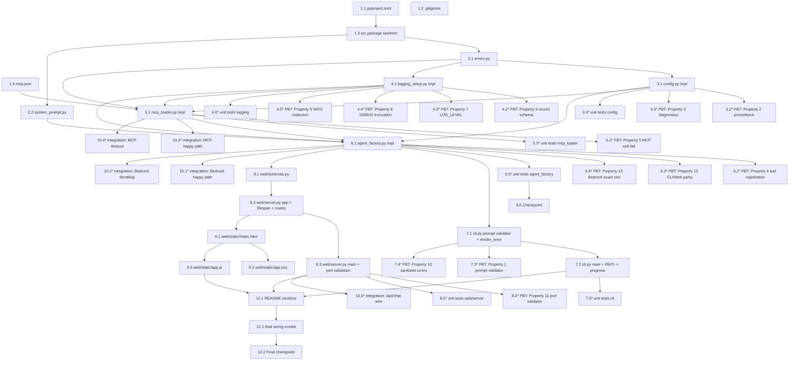

# Implementation Plan: strands-bedrock-agent

## Overview

This plan converts the approved design into a sequence of PR-sized coding tasks for the `strands-bedrock-agent` Python project. The order respects module dependencies from the design: project scaffolding first, then pure-logic modules (config, logging, errors, system_prompt), then I/O modules (mcp_loader, agent_factory), then the two entry points (cli, web), then the static frontend, then docs, then final wiring and integration tests.

The implementation language is **Python 3.10+** (set explicitly by the design: dataclasses, Pydantic, FastAPI, pytest, Hypothesis). Property-based tests use Hypothesis with `@settings(max_examples=100)` per the design's Testing Strategy. All Bedrock and MCP calls in tests use mocks (hand-rolled `botocore.stub.Stubber` for Bedrock; an in-process `MCPClient` substitute for MCP) — no real AWS credentials or network access are required to run the test suite.

## Task Dependency Graph (Mermaid)



## Tasks

- [ ] 1. Project scaffolding
  - [x] 1.1 Create `pyproject.toml`
    - Set `[project]` name `strands-bedrock-agent`, version `0.1.0`, `requires-python = ">=3.10"`.
    - Declare runtime deps: `strands-agents>=1.0,<2.0`, `strands-agents-tools` (or the equivalent MCP-enabling extra named in the SDK), `mcp` (the upstream Model Context Protocol Python package providing `mcp.client.streamable_http`), `boto3`, `botocore`, `fastapi`, `uvicorn[standard]`, `pydantic>=2,<3`.
    - Declare dev deps in `[project.optional-dependencies].dev`: `pytest`, `pytest-asyncio`, `hypothesis`, `httpx`, `ruff`, `black`.
    - Declare console scripts: `strands-bedrock-agent = "strands_bedrock_agent.cli:main"` and `strands-bedrock-agent-web = "strands_bedrock_agent.web.server:main"`.
    - Configure `[tool.setuptools.packages.find]` to discover `src/strands_bedrock_agent` (include `web` and `web.static`).
    - Pin each declared dependency to an explicit version range.
    - No tests required for this task.
    - _Requirements: 1.1, 1.2, 1.3, 1.4, 6.1, 9.1_

  - [x] 1.2 Create `.gitignore` at repository root
    - Exclude `.venv/`, `venv/`, `env/`, `dist/`, `build/`, `*.egg-info/`, `__pycache__/`, `*.pyc`, `.pytest_cache/`, `.hypothesis/`, `.mypy_cache/`, `.ruff_cache/`, `.env`, `.env.*`.
    - No tests required for this task.
    - _Requirements: 1.7_

  - [x] 1.3 Create the `src/strands_bedrock_agent/` package skeleton
    - Create `src/strands_bedrock_agent/__init__.py` exposing `__version__ = "0.1.0"`.
    - Create `src/strands_bedrock_agent/__main__.py` that imports and calls `cli.main()` (placeholder `pass` until cli is implemented; replace in task 7.2).
    - Create empty `src/strands_bedrock_agent/web/__init__.py` and `src/strands_bedrock_agent/web/__main__.py` (placeholder; replace in task 8.3).
    - Create empty `tests/__init__.py` and `tests/conftest.py` placeholder.
    - No tests required for this task.
    - _Requirements: 1.1_

  - [x] 1.4 Create `.kiro/settings/mcp.json`
    - Write the AWS Knowledge MCP Server entry per the design's Data Models section: `mcpServers."aws-knowledge-mcp-server"` with `url: "https://knowledge-mcp.global.api.aws"`, `type: "http"`, `disabled: false`.
    - No tests required for this task.
    - _Requirements: 5.1_

- [x] 2. Shared pure-Python modules (no external I/O)
  - [x] 2.1 Implement `errors.py`
    - Define the error taxonomy classes from the design's Error Handling table: `ConfigError`, `CredentialsError`, `ModelUnavailableError`, `BedrockAccessDeniedError`, `BedrockRetryExhaustedError`, `MCPToolError`, `MCPToolTimeoutError`, `ToolRegistrationError`, `StrandsCompatError`, `PromptValidationError`, `PortValidationError`, `PortInUseError`, `AgentError`.
    - Each class accepts the structured fields the design's error mapping requires (e.g., `ModelUnavailableError(model_id, region, hint)`, `ConfigError(knob, checked: tuple[str, ...])`).
    - Define module-level constant mapping from category to CLI exit code matching the design table.
    - Define `render_error(category: str, message: str) -> str` that returns a single human-readable line and strips any AWS access-key-shaped substrings (regex `(AKIA|ASIA)[0-9A-Z]{16}`) and the substring `"Traceback"`.
    - No tests required in this task; Property 10 covers `render_error` in task 7.4.
    - _Requirements: 3.5, 3.6, 3.7, 4.6, 4.7, 4.8, 5.6, 5.7, 7.7, 7.8, 9.11_

  - [x] 2.2 Implement `system_prompt.py`
    - Export `SYSTEM_PROMPT: str` containing the prompt text from the design (≥50 characters, names the role, instructs the Agent to invoke `search_documentation`, `read_documentation`, `recommend` whenever the user prompt mentions an AWS service, AWS API, AWS documentation, or AWS error message).
    - Add a module-level assertion `assert len(SYSTEM_PROMPT) >= 50` so import-time failure surfaces accidental truncation.
    - No tests required for this task.
    - _Requirements: 2.2_

- [x] 3. Configuration module
  - [x] 3.1 Implement `config.py`
    - Define module constants `DEFAULT_MODEL_ID`, `DEFAULT_LOG_LEVEL`, `DEFAULT_MCP_CONFIG_PATH`, `DEFAULT_WEB_PORT = 8765`, `DEFAULT_WEB_HOST = "127.0.0.1"`, `DEFAULT_MAX_PROMPT_LENGTH = 10000`, `DEFAULT_MCP_CONNECT_TIMEOUT = 10`, `DEFAULT_MCP_TOOL_TIMEOUT = 30`, `DEFAULT_WEB_REQUEST_TIMEOUT = 120`, `VALID_LOG_LEVELS`, `AWS_REGION_RE`.
    - Define the frozen `Config` dataclass exactly as in the design (including `region_sources_checked` and `log_level_was_invalid`).
    - Implement `load_config(*, cli_overrides=None, env=None, file_path=None) -> Config` with precedence CLI > env > file > default per Property 2; for `aws_region` also consult the boto3 profile region as the fourth source per the design.
    - Raise `ConfigError("aws_region", checked=(...))` listing every source actually checked when the region is unresolved (Property 3).
    - On invalid `LOG_LEVEL`, set `log_level="INFO"` and `log_level_was_invalid=True`; do NOT raise.
    - Never read AWS credentials (R4.5).
    - No tests required in this task; Properties 2 and 3 are covered in tasks 3.2 and 3.3.
    - _Requirements: 3.2, 3.3, 4.2, 4.4, 4.5, 7.2, 7.3, 9.2, 9.3_

  - [x] 3.2 Write property test for configuration precedence (Property 2)
    - **Property 2: Configuration precedence is monotone** — env > file > default; `None` triple raises `ConfigError` for required knobs.
    - Use `hypothesis.strategies.text()` and `none()` to generate `(env_value, file_value, default_value)` triples (1–256 chars or `None`) and assert the resolved value is the highest-priority non-`None` component.
    - Apply `@settings(max_examples=100)` to the property test.
    - Tag the docstring `Feature: strands-bedrock-agent, Property 2: Configuration precedence is monotone`.
    - No real AWS calls; pure transformation test.
    - **Validates: Requirements 3.2, 3.3, 4.2**

  - [x] 3.3 Write property test for diagnostic completeness (Property 3)
    - **Property 3: Diagnostic completeness for missing required values** — the `ConfigError` message names the knob and contains every checked source.
    - For `model_id` and `aws_region`, generate every subset of sources `{env, file, default}` (and `profile` for region) being absent and assert the error's `checked` tuple contains every canonical source name.
    - Apply `@settings(max_examples=100)`.
    - Tag the docstring `Feature: strands-bedrock-agent, Property 3: Diagnostic completeness for missing required values`.
    - **Validates: Requirements 3.5, 4.3**

  - [x] 3.4 Write example-based unit tests for `config.py`
    - Cover: invalid `LOG_LEVEL` returns `INFO` with `log_level_was_invalid=True`; explicit `aws_profile` is preserved; `MCP_CONFIG_PATH` env override resolves to the supplied path; web port default is `8765`; max prompt length default is `10000`.
    - _Requirements: 7.3, 4.4, 5.1, 9.2, 2.4, 6.3_

- [x] 4. Logging module
  - [x] 4.1 Implement `logging_setup.py`
    - Define event-name constants from the design (`EVENT_CONFIG_RESOLVED`, `EVENT_BEDROCK_INVOKE_START`, `EVENT_BEDROCK_INVOKE_END`, `EVENT_BEDROCK_RETRY`, `EVENT_MCP_CONNECT`, `EVENT_MCP_TOOL_START`, `EVENT_MCP_TOOL_END`, `EVENT_AGENT_ERROR`) and `PROMPT_TRUNCATION_LIMIT = 4096` plus a `TRUNCATION_MARKER = "…[truncated]"` constant.
    - Implement a `JsonFormatter(logging.Formatter)` that emits one JSON object per record with keys `ts` (UTC ISO 8601 with offset, e.g., `datetime.now(timezone.utc).isoformat()`), `level`, `event`, `logger`, plus extra fields.
    - Implement `configure_logging(level: str, log_level_was_invalid: bool) -> None` that installs the formatter on the root logger, sets the parsed level (uppercased, stripped) or `INFO` on miss, and emits exactly one WARNING record naming `LOG_LEVEL` when `log_level_was_invalid` is true.
    - Implement `redact_for_debug(field_name, value)` (Property 8): truncates strings > 4096 chars with `TRUNCATION_MARKER` appended.
    - Implement `redact_for_info(record_dict)` (Property 9): drops keys in `{"prompt", "tool_args", "tool_result"}` and replaces them with `<key>_bytes = len(value.encode("utf-8"))`, preserving every other key.
    - Implement `log_event(logger, level, event, **fields)` that dispatches to debug-truncation or info-redaction based on `level`, then emits via `logger.log(level, ...)`.
    - No tests required in this task; Properties 6, 7, 8, 9 are covered in tasks 4.2–4.5.
    - _Requirements: 7.1, 7.2, 7.3, 7.4, 7.5_

  - [x] 4.2 Write property test for log record schema (Property 6)
    - **Property 6: Log record structural invariant** — every emitted JSON record contains `ts`, `level`, `event`, `logger` non-empty strings; `ts` parses ISO 8601; `level ∈ VALID_LOG_LEVELS`; the additional keys equal the post-redaction field set.
    - Use a captured-records fixture (a `logging.Handler` that appends to a list) and Hypothesis to generate random `(level, event, fields)` triples.
    - Apply `@settings(max_examples=100)`.
    - Tag the docstring `Feature: strands-bedrock-agent, Property 6: Log record structural invariant`.
    - **Validates: Requirements 7.1**

  - [x] 4.3 Write property test for LOG_LEVEL resolution (Property 7)
    - **Property 7: LOG_LEVEL resolution partition** — valid levels (any case) set the root level and emit zero LOG_LEVEL warnings; invalid non-empty values fall back to INFO and emit exactly one WARNING containing the offending value verbatim and the literal `LOG_LEVEL`.
    - Drive `configure_logging` with `hypothesis.strategies.text()` plus a strategy that mixes case for valid levels.
    - Apply `@settings(max_examples=100)`.
    - Tag the docstring `Feature: strands-bedrock-agent, Property 7: LOG_LEVEL resolution partition`.
    - **Validates: Requirements 7.2, 7.3**

  - [x] 4.4 Write property test for DEBUG truncation (Property 8)
    - **Property 8: DEBUG truncation property** — for any string `s` and field `f ∈ {"prompt", "tool_args", "tool_result"}`, output equals `s` when `len(s) <= 4096` and `s[:4096] + TRUNCATION_MARKER` otherwise; prefix preservation holds in both cases.
    - Use `hypothesis.strategies.text(min_size=0, max_size=10000)`.
    - Apply `@settings(max_examples=100)`.
    - Tag the docstring `Feature: strands-bedrock-agent, Property 8: DEBUG truncation property`.
    - **Validates: Requirements 7.4**

  - [x] 4.5 Write property test for INFO+ redaction (Property 9)
    - **Property 9: INFO+ redaction property** — `redact_for_info` removes `prompt`/`tool_args`/`tool_result`, replaces each with `<key>_bytes = len(value.encode("utf-8"))`, and preserves every other key/value.
    - Generate dicts via `hypothesis.strategies.dictionaries(text(), text())`, optionally injecting the protected keys.
    - Apply `@settings(max_examples=100)`.
    - Tag the docstring `Feature: strands-bedrock-agent, Property 9: INFO+ redaction property`.
    - **Validates: Requirements 7.5**

  - [x] 4.6 Write example-based unit tests for `logging_setup.py`
    - Verify the exact JSON shape of an `EVENT_BEDROCK_INVOKE_START` record at INFO and DEBUG; verify a `bedrock.retry` record carries `attempt` and `aws_error_code`; verify `agent.error` records do not include keys from the protected set.
    - _Requirements: 7.1, 7.5, 7.6_

- [x] 5. MCP loader module
  - [x] 5.1 Implement `mcp_loader.py`
    - Define `MCPServerSpec` and `MCPLoadResult` dataclasses exactly as in the design.
    - Implement `parse_mcp_config(path)` that reads `.kiro/settings/mcp.json`, validates the `mcpServers` map, requires `url`, requires `type == "http"` (raise `ConfigError` for `"stdio"` or `"sse"`), and respects `disabled: true` by skipping that entry.
    - Implement `load_mcp_tools(specs, connect_timeout_seconds, operator_stream)` that, for each enabled spec, builds an `MCPClient(lambda: streamablehttp_client(url=spec.url))`, calls `client.start()`, calls `client.list_tools_sync()`, and joins the returned tools.
    - On per-server failure (timeout, connection error, any exception during `start` or `list_tools_sync`): emit `EVENT_MCP_CONNECT` WARNING with the endpoint and underlying error, write one operator-visible line to `operator_stream` ("AWS documentation tools unavailable for this session: <server_name>"), record the failure in `MCPLoadResult.failures`, and continue with that server contributing zero tools.
    - The function MUST NOT raise on connection failure (soft-fail per R5.5); it raises only on malformed config (Property invariant: connection failures are absorbed).
    - All Bedrock and MCP I/O is real `MCPClient` here; tests in 5.2 and 5.3 inject a mock `MCPClient` substitute.
    - No tests required in this task; Property 5 is covered in task 5.2.
    - _Requirements: 5.1, 5.2, 5.3, 5.5_

  - [x]* 5.2 Write property test for MCP soft-fail (Property 5)
    - **Property 5: MCP soft-fail invariant** — for any exception class `E ∈ {TimeoutError, ConnectionRefusedError, RuntimeError, ValueError, Exception}` raised during `start()` or `list_tools_sync()`, `load_mcp_tools` returns a result whose `tools == []` for the failed server, whose `failures` names the failed server and the underlying error, and exactly one human-readable warning line was written to the operator stream.
    - Use a parametrised mock `MCPClient` substitute (no real network calls) whose `start` and `list_tools_sync` raise the chosen exception.
    - Use Hypothesis to sample which exception class is raised and at which step.
    - Apply `@settings(max_examples=100)`.
    - Tag the docstring `Feature: strands-bedrock-agent, Property 5: MCP soft-fail invariant`.
    - **Validates: Requirements 5.5**

  - [x]* 5.3 Write example-based unit tests for `mcp_loader.py`
    - Cover: malformed JSON raises `ConfigError`; `disabled: true` server is skipped silently; `type: "stdio"` raises `ConfigError`; happy path against a mock `MCPClient` that returns a non-empty tool list.
    - _Requirements: 5.1, 5.3_

- [x] 6. Agent factory
  - [x] 6.1 Implement `agent_factory.py`
    - Define `AgentBundle` dataclass implementing `AbstractContextManager` with `agent`, `mcp_clients`, `registered_tool_names`, `mcp_failures` fields, and `__exit__` that closes every `MCPClient` (best-effort).
    - Implement `build_agent(config: Config) -> AgentBundle` performing the steps from the design in this exact order:
      1. Construct `boto3.Session(profile_name=config.aws_profile)`; on `botocore.exceptions.ProfileNotFound` raise `CredentialsError` (R4.8); on no resolvable credentials raise `CredentialsError` (R4.6).
      2. Verify Bedrock model availability: if `config.bedrock_model_id` starts with one of `"us."`, `"eu."`, `"global."`, call `bedrock.list_inference_profiles` and match `inferenceProfileId`; otherwise call `bedrock.list_foundation_models(byProvider="anthropic")` and match `modelId`. On miss, raise `ModelUnavailableError(model_id, region, hint=f"aws bedrock list-foundation-models --region {region}")` (R3.6).
      3. Construct `BedrockModel(model_id=config.bedrock_model_id, region_name=config.aws_region, boto_session=session)` exactly once with no transformation (Property 13).
      4. Call `mcp_loader.parse_mcp_config(config.mcp_config_path)` then `mcp_loader.load_mcp_tools(...)`.
      5. Wrap each MCP tool callable in a recording shim that appends `(tool_name, started_at, completed_at)` to a per-Agent thread-local list (used by `web/server.py` for `tool_invocations` reporting).
      6. Construct `strands.Agent(model=bedrock_model, tools=mcp_tools, system_prompt=SYSTEM_PROMPT)`. Catch `AttributeError`/`TypeError` from missing/incompatible Strands classes and re-raise as `StrandsCompatError` (R2.7).
      7. Verify `set(agent.tool_registry.tool_names) >= set(expected_tool_names)`; on miss, raise `ToolRegistrationError(missing=...)` (R2.6).
      8. Emit `EVENT_CONFIG_RESOLVED` log record (R7.1) and return the `AgentBundle`.
    - Expose a public helper `get_recorded_invocations(bundle) -> list[ToolInvocation]` so the web layer can drain the thread-local list per request.
    - No tests required in this task; Properties 4, 12, 13 are covered in tasks 6.2–6.4.
    - _Requirements: 2.1, 2.2, 2.5, 2.6, 2.7, 3.1, 3.4, 3.6, 3.7, 4.4, 4.6, 4.7, 4.8, 5.2, 5.3, 7.1_

  - [ ]* 6.2 Write property test for tool registration partition (Property 4)
    - **Property 4: Tool registration partition** — for any `(expected_tools, actual_tools)` pair, `build_agent` either returns `AgentBundle` with `tool_registry.tool_names == actual_tools` (when `actual_tools ⊇ expected_tools`) or raises `ToolRegistrationError` whose message contains every missing name.
    - Use a stub Strands `Agent` and a mock `MCPClient` that yields the chosen `actual_tools` set. Generate `(expected, actual)` finite string-set pairs via Hypothesis.
    - Apply `@settings(max_examples=100)`.
    - Tag the docstring `Feature: strands-bedrock-agent, Property 4: Tool registration partition`.
    - **Validates: Requirements 2.5, 2.6**

  - [ ]* 6.3 Write property test for CLI/Web Agent parity (Property 12)
    - **Property 12: CLI/Web Agent parity** — for any valid `Config c`, the `AgentBundle` produced by the CLI startup path and the Web Backend lifespan path are observationally identical: same `model.config["model_id"]`, same `model.config["region_name"]`, same `set(registered_tool_names)`, same `mcp_failures`.
    - Build two bundles from the same `Config` (one via the CLI path, one via the Web lifespan path) using a deterministic mock `MCPClient` and a deterministic mock `BedrockModel`. Assert observational equality across the four observables.
    - Apply `@settings(max_examples=100)` over Hypothesis-generated valid `Config` instances.
    - Tag the docstring `Feature: strands-bedrock-agent, Property 12: CLI/Web Agent parity`.
    - **Validates: Requirements 9.6**

  - [ ]* 6.4 Write property test for exact Bedrock construction (Property 13)
    - **Property 13: Bedrock model construction is exact** — for any valid `(model_id, region)` pair from `load_config`, `BedrockModel` is called once with exactly `model_id=model_id, region_name=region`, no fallback, no second instance for the same `AgentBundle`.
    - Use `unittest.mock.patch` on `strands.models.bedrock.BedrockModel` to capture call arguments; assert `mock.call_args_list == [call(model_id=m, region_name=r, boto_session=ANY)]`.
    - Apply `@settings(max_examples=100)` over generated valid `(model_id, region)` strings.
    - Tag the docstring `Feature: strands-bedrock-agent, Property 13: Bedrock model construction is exact`.
    - **Validates: Requirements 3.1, 3.4**

  - [ ]* 6.5 Write example-based unit tests for `agent_factory.py`
    - Cover: missing AWS profile raises `CredentialsError` naming the profile (mock `botocore.exceptions.ProfileNotFound`); model not enabled in region raises `ModelUnavailableError` whose hint contains `aws bedrock list-foundation-models --region <region>`; Strands SDK incompatibility (mock `Agent` class missing) raises `StrandsCompatError`; access denied error path raises `BedrockAccessDeniedError` (mock `bedrock-runtime` `AccessDeniedException`).
    - _Requirements: 2.7, 3.6, 3.7, 4.7, 4.8_

  - [x] 6.6 Checkpoint - core modules complete
    - Ensure all tests pass, ask the user if questions arise.

- [ ] 7. CLI entry point
  - [x] 7.1 Implement prompt validation and error rendering helpers in `cli.py`
    - Implement `validate_prompt(s: str, max_len: int) -> str` that returns `s.strip()` iff `1 <= len(s) <= max_len` AND `len(s.strip()) >= 1`, else raises `PromptValidationError` (Property 1). Caller MUST NOT invoke the Agent on rejection.
    - Wire `errors.render_error` into the CLI's stderr output path so every operator-visible message is sanitised (Property 10).
    - No tests required in this task; Properties 1 and 10 are covered in tasks 7.3 and 7.4.
    - _Requirements: 2.4, 6.3, 7.7_

  - [x] 7.2 Implement `cli.py` `main()` and REPL
    - Implement `build_arg_parser()` with `--prompt`, `--log-level`, and `--help` matching the design's argparse layout.
    - Implement `main(argv=None) -> int`:
      - Resolve `Config` via `load_config(cli_overrides=...)`, configure logging, build the Agent via `agent_factory.build_agent`.
      - If `--prompt` is given: call `validate_prompt`, invoke the Agent once, print the response to stdout, exit `0`. On unhandled Agent exception, print `render_error(...)` to stderr and exit non-zero (R6.7).
      - If `--prompt` is omitted: enter REPL reading one line per prompt from stdin; treat `exit`, `quit`, and EOF as exit signals; on Agent exception print sanitised error to stderr and continue (R6.8).
      - Map exit codes to the design's error table (`2`/`3`/`4`/`5`/`6`/`7`/`8`/`9`).
    - Implement the progress indicator: a daemon thread that writes a rotating spinner character to stderr at least once per second while the Agent is processing in interactive mode; signal it to stop when the Agent returns or raises (R6.6).
    - Update `src/strands_bedrock_agent/__main__.py` to call `cli.main()`.
    - No tests required in this task; tasks 7.3, 7.4, 7.5 cover behavior.
    - _Requirements: 6.1, 6.2, 6.4, 6.5, 6.6, 6.7, 6.8, 6.9_

  - [ ]* 7.3 Write property test for prompt validator (Property 1)
    - **Property 1: Prompt validator partition** — for any string `s`, `validate_prompt(s, max_len)` returns `s.strip()` iff `1 <= len(s) <= max_len` AND `len(s.strip()) >= 1`; otherwise raises `PromptValidationError` and the Agent's `invoke` method MUST NOT have been called.
    - Use Hypothesis `text(min_size=0, max_size=12000)` and an injected mock Agent whose `invoke` is a `MagicMock`. Assert mock not called whenever the validator raised.
    - Apply `@settings(max_examples=100)`.
    - Tag the docstring `Feature: strands-bedrock-agent, Property 1: Prompt validator partition`.
    - **Validates: Requirements 2.4, 6.3, 9.8**

  - [ ]* 7.4 Write property test for sanitised error rendering (Property 10)
    - **Property 10: Sanitised error rendering** — for any error message `m` and any AKIA/ASIA-shaped string `k`, `render_error(...)` does not contain `k`, does not contain `Traceback`, contains the failure category and a single human-readable sentence, and contains the configured Bedrock model id and AWS error code where applicable.
    - Use Hypothesis to compose messages that embed a generated AWS-key-shaped substring (regex `(AKIA|ASIA)[0-9A-Z]{16}`) and verify the output. Also embed `"Traceback (most recent call last):"` and verify it is stripped.
    - Apply `@settings(max_examples=100)`.
    - Tag the docstring `Feature: strands-bedrock-agent, Property 10: Sanitised error rendering`.
    - **Validates: Requirements 7.7, 9.11**

  - [ ]* 7.5 Write example-based unit tests for `cli.py`
    - Cover: `--help` exits `0` within 5 seconds and lists every supported argument (R6.5); single-prompt happy path prints to stdout and exits `0` (Bedrock and MCP both mocked); REPL exits on `exit`, `quit`, EOF (R6.4); progress indicator thread writes ≥1 spinner character per second during a 2.5s mocked Agent call (R6.6); Agent exception in interactive mode does not exit the REPL (R6.8); `PromptValidationError` in single-prompt mode exits with status 2 and writes to stderr (R6.3).
    - _Requirements: 6.2, 6.3, 6.4, 6.5, 6.6, 6.7, 6.8_

- [ ] 8. Web backend
  - [x] 8.1 Implement `web/schemas.py`
    - Define `ChatRequest`, `ToolInvocation`, `ChatResponse`, `ErrorResponse` Pydantic models exactly as in the design (including the `not_blank` validator on `prompt`).
    - `ToolInvocation.started_at` and `completed_at` MUST serialize to ISO 8601 with UTC offset (use `datetime` with `tzinfo=timezone.utc` and Pydantic v2 default ISO serialization).
    - No tests required in this task; covered by 8.5 and 10.5.
    - _Requirements: 9.7, 9.8_

  - [x] 8.2 Implement `web/server.py` FastAPI app, lifespan, and routes
    - Implement the `lifespan` async context manager that calls `load_config()`, `build_agent(config)`, and stores both on `app.state`. On shutdown, exit the `AgentBundle`.
    - Mount `/static` at `src/strands_bedrock_agent/web/static`.
    - Implement `GET /` returning `index.html` as a `FileResponse`.
    - Implement `POST /api/chat`:
      - Pydantic validates the body (HTTP 400 with `{"error": ...}` on validation failure or non-`application/json` content-type — R9.8).
      - Call `validate_prompt` again post-Pydantic (defence in depth) to enforce the `not_blank` and length rule with the same `PromptValidationError` taxonomy.
      - Drain any pre-existing recorded invocations (thread-local) before invoking the Agent.
      - Run `bundle.agent.invoke_async(prompt)` with an `asyncio.wait_for(timeout=config.web_request_timeout)`. On `asyncio.TimeoutError`, return HTTP 500 `{"error": "timeout: ..."}` (R9.10, R9.11).
      - On success, drain the recorded invocations and return `ChatResponse`.
      - On any other exception, classify into category (`bedrock`/`mcp`/`unhandled`) and return HTTP 500 `{"error": render_error(category, message)}` (R9.11).
    - Emit the structured logs from R7 for every request (R9.12).
    - No tests required in this task; covered by 8.5 and 10.5.
    - _Requirements: 9.2, 9.6, 9.7, 9.8, 9.10, 9.11, 9.12_

  - [x] 8.3 Implement `web/server.py` `main()` and port validation
    - Implement `validate_port(p) -> int` returning `p` as int iff convertible and in `[1024, 65535]`, else raising `PortValidationError` whose message contains the offending value/type and the literal string `"1024-65535"` (Property 11).
    - Implement `main(argv=None) -> int` that:
      - Parses `--port` (default `WEB_PORT` env or `8765`), `--host` (default `127.0.0.1`), `--allow-non-loopback` (flag, default `False`).
      - Validates port; on failure prints to stderr and exits `2` within 5 seconds (R9.4).
      - Refuses any host other than `127.0.0.1` unless `--allow-non-loopback` is passed; on refusal prints to stderr and exits `2` (R9.5).
      - Attempts a pre-bind probe `socket.bind((host, port))` then closes; on `OSError` (port in use), prints to stderr and exits `2` (R9.4).
      - Prints exactly one line to stdout: `Listening on http://<host>:<port>` (R9.2).
      - Calls `uvicorn.run("strands_bedrock_agent.web.server:app", host=host, port=port, log_config=None)`.
    - Update `src/strands_bedrock_agent/web/__main__.py` to call `web.server.main()`.
    - No tests required in this task; Property 11 in 8.4 and unit tests in 8.5.
    - _Requirements: 9.1, 9.2, 9.3, 9.4, 9.5_

  - [ ]* 8.4 Write property test for port validator (Property 11)
    - **Property 11: Port validator partition** — `validate_port(p)` returns `int(p)` iff `p` is convertible to an int in `[1024, 65535]`; otherwise raises `PortValidationError` whose message contains both the offending value (or its type) and the literal `"1024-65535"`.
    - Use Hypothesis to generate integers, floats, strings, `None`, very large ints, and integers outside the range.
    - Apply `@settings(max_examples=100)`.
    - Tag the docstring `Feature: strands-bedrock-agent, Property 11: Port validator partition`.
    - **Validates: Requirements 9.3, 9.4**

  - [ ]* 8.5 Write example-based unit tests for `web/server.py`
    - Use `httpx.AsyncClient` with `ASGITransport(app=app)` and a stub `AgentBundle` injected on `app.state`. Cover: 200 happy path returns `response` and `tool_invocations`; 400 on missing `Content-Type`; 400 on missing `prompt`; 400 on whitespace-only `prompt`; 400 on prompt > 10000 chars; 500 on simulated Agent exception (verify no `Traceback` in body, no AKIA/ASIA in body); startup line "Listening on http://127.0.0.1:8765" is printed when default port is used; `--allow-non-loopback` flag permits `0.0.0.0`; bind to a busy port exits with status `2`.
    - _Requirements: 9.2, 9.3, 9.4, 9.5, 9.7, 9.8, 9.11_

- [ ] 9. Web frontend (single-page UI)
  - [x] 9.1 Create `web/static/index.html`
    - Implement the structure from the design's *Module: web/static/index.html*: header with title and "Local test UI — not a production application" disclaimer, `#transcript` log container, `#tool-invocations` chip container, `#status` in-progress indicator, `<form id="prompt-form">` with `<textarea id="prompt-input" maxlength="10000" required>` and `<button id="send-btn" type="submit">`. Include `<link rel="stylesheet" href="/static/app.css">` and `<script src="/static/app.js"></script>`.
    - No automated tests; this is covered by the documented manual smoke test in the README (task 11.1) and the integration test in 10.5.
    - _Requirements: 9.2, 9.9, 9.13_

  - [x] 9.2 Create `web/static/app.css`
    - Provide minimal styling for the transcript, tool-invocation chips (each rendered as a labelled pill with the tool name and start timestamp), the spinner in `#status`, and the disabled state of `#send-btn` and `#prompt-input` while `#status` is visible.
    - No tests required for this task.
    - _Requirements: 9.9, 9.10_

  - [x] 9.3 Create `web/static/app.js`
    - Implement the submit handler exactly as in the design's *Module: web/static/app.js*: trim the prompt; refuse empty submissions client-side; `setBusy(true)` disables `sendBtn` and `input` and unhides `#status`; `fetch('/api/chat', {method: 'POST', headers: {'Content-Type': 'application/json'}, body: JSON.stringify({prompt}), signal: ac.signal})`; render the `response` text into `#transcript`; render every `tool_invocations` entry as a chip in `#tool-invocations` labelled with `tool_name` and `started_at`; on `!resp.ok` render `body.error`; on `AbortError` from a 120-second timeout render "Request timed out after 120 seconds"; in the `finally` block call `setBusy(false)` so the operator can submit the next prompt.
    - No automated tests for this task; manual smoke test acceptable per the user's guidance. The wire shape is exercised end-to-end in task 10.5 against the FastAPI app.
    - _Requirements: 9.9, 9.10, 9.11_

- [ ] 10. Integration tests (mocked external services)
  - [ ]* 10.1 Integration test: Bedrock happy path
    - Build the Agent via `agent_factory.build_agent` with `BedrockModel.invoke` mocked (hand-rolled `botocore.stub.Stubber` on the bedrock-runtime client) to return a fixed Converse response. Assert the Agent surfaces the assistant text and that `EVENT_BEDROCK_INVOKE_START` and `EVENT_BEDROCK_INVOKE_END` records are emitted.
    - All Bedrock calls are mocked.
    - _Requirements: 2.3, 3.1, 3.4, 7.1_

  - [ ]* 10.2 Integration test: Bedrock throttling and retry logging
    - Configure `Stubber` to raise `ThrottlingException` twice, then succeed. Assert two `bedrock.retry` WARNING records (each carrying `attempt` and `aws_error_code`) are emitted (R7.6) and the final response is returned.
    - All Bedrock calls are mocked.
    - _Requirements: 7.6, 7.7_

  - [ ]* 10.3 Integration test: MCP happy path
    - Use a local in-process MCP stub (a small `MCPClient` substitute) that exposes a `search_documentation` tool. Build the Agent, invoke a prompt that should trigger the tool, assert the tool callable was invoked and the result is folded into the final response. Verify `EVENT_MCP_TOOL_START` and `EVENT_MCP_TOOL_END` records.
    - All MCP calls are mocked; no real network access.
    - _Requirements: 5.3, 5.4, 7.1_

  - [ ]* 10.4 Integration test: MCP tool timeout
    - Use the in-process MCP stub configured to never respond. Assert the MCP client cancels the call after `MCP_TOOL_TIMEOUT_SECONDS` and the timeout error names the invoked tool (R5.7).
    - All MCP calls are mocked.
    - _Requirements: 5.7, 7.8_

  - [ ]* 10.5 Integration test: `/api/chat` end-to-end wire
    - Run FastAPI in-process via `httpx.AsyncClient` + `ASGITransport`, with a stub `AgentBundle` whose `invoke_async` returns a known string and records two tool invocations. Assert the JSON wire shape matches the design exactly: `response: str`, `tool_invocations: [{tool_name, started_at, completed_at}]` with ISO 8601 + UTC offset timestamps. Cover the happy path, the 400 cases (missing prompt, whitespace prompt, oversize prompt, wrong content-type), and the 500 case (sanitised body, no AKIA/ASIA leakage, no `Traceback`).
    - All Bedrock and MCP calls are mocked.
    - _Requirements: 9.7, 9.8, 9.11, 9.12_

- [ ] 11. Project documentation
  - [x] 11.1 Write `README.md`
    - Section "Overview" (1–5 sentences) listing the Strands Agents SDK, Amazon Bedrock, and the AWS Knowledge MCP Server (R8.1).
    - Section "Prerequisites" listing Python 3.10+, AWS account with Bedrock access, Claude Opus access in the configured Region, and configured AWS credentials with `bedrock:InvokeModel` permission (R8.2).
    - Section "Setup" with numbered, copy-pasteable commands: `python -m venv .venv`, activation per OS, `pip install -e ".[dev]"`, `aws configure` reference, the exact `.kiro/settings/mcp.json` content from task 1.4 (R8.3, R5.1).
    - Section "Bedrock model access" describing how to enable Claude Opus access in the Bedrock console for the target Region, listing both `us.anthropic.claude-opus-4-5-20251101-v1:0` and `us.anthropic.claude-opus-4-6-v1` (R3.8).
    - Section "Configuration" — single table listing every configurable knob from the design's Configuration model (env var, default, accepted values) (R8.5).
    - Section "Running the CLI" with a copy-pasteable end-to-end example: command, sample prompt, sample response, and expected log output at the default level (R8.4, R8.6, R8.7).
    - Section "Running the Web UI" documenting the `strands-bedrock-agent-web` command, default loopback bind `127.0.0.1`, default port `8765`, accepted port range `1024-65535`, the `/api/chat` request and response JSON shapes (mirroring the design's Web `/api/chat` examples), and the explicit "intended for local developer testing only — not a production-grade application" disclaimer (R9.13).
    - Section "Logging" describing each event from R7.1, the default `INFO` log level, and the recommended `DEBUG` level for development (R7.9).
    - Section "AWS Knowledge MCP Server" listing the endpoint `https://knowledge-mcp.global.api.aws`, stating that no AWS credentials are required to call the MCP server itself, and naming the tools the Agent expects (`search_documentation`, `read_documentation`, `recommend`) (R5.8).
    - Every command, configuration snippet, and environment variable rendered in fenced code blocks (R8.7).
    - No tests required for this task.
    - _Requirements: 3.8, 5.8, 7.9, 8.1, 8.2, 8.3, 8.4, 8.5, 8.6, 8.7, 9.13_

- [ ] 12. Final wiring
  - [x] 12.1 Final wiring smoke
    - Verify `pip install -e ".[dev]"` succeeds in a fresh virtual environment.
    - Verify `strands-bedrock-agent --help` exits 0 and lists every argument.
    - Verify `strands-bedrock-agent-web --help` exits 0.
    - Verify `python -m strands_bedrock_agent --help` and `python -m strands_bedrock_agent.web --help` work as documented fallbacks (R6.1, R9.1).
    - Run `pytest` and confirm every non-optional task's tests pass, plus all property tests written so far.
    - No tests required for this task; this is the wiring verification step itself.
    - _Requirements: 1.5, 1.6, 6.1, 9.1_

  - [x] 12.2 Final checkpoint - Ensure all tests pass
    - Ensure all tests pass, ask the user if questions arise.

## Notes

- Tasks marked with `*` are optional from the workflow's perspective and can be skipped for a faster MVP; the test surface (one PBT per correctness property + targeted unit tests + five integration tests) is intended to be implemented in full for production-readiness, but a minimal MVP can ship by completing only the unmarked tasks.
- Each task references specific requirements clauses (granular sub-requirements, not just user stories) for traceability.
- Property-based tests use Hypothesis with `@settings(max_examples=100)` and tag each docstring with the design's property number (`Property N`) per the design's Testing Strategy.
- All Bedrock calls in tests use a hand-rolled `botocore.stub.Stubber` on the `bedrock-runtime` client (no real AWS network access). All MCP calls in tests use an in-process `MCPClient` substitute (no real MCP network access).
- The web frontend (HTML/CSS/JS) has no automated unit tests; its wire shape is verified end-to-end via task 10.5 against the FastAPI app, and a manual smoke test is documented in the README per the user's guidance.
- Checkpoints (6.6, 12.2) are explicit pause-and-confirm steps; they are excluded from the dependency graph below since only leaf sub-tasks are scheduled.

## Task Dependency Graph

```json
{
  "waves": [
    { "id": 0, "tasks": ["1.1", "1.2", "1.4"] },
    { "id": 1, "tasks": ["1.3"] },
    { "id": 2, "tasks": ["2.1", "2.2"] },
    { "id": 3, "tasks": ["3.1", "4.1"] },
    { "id": 4, "tasks": ["3.2", "3.3", "3.4", "4.2", "4.3", "4.4", "4.5", "4.6", "5.1"] },
    { "id": 5, "tasks": ["5.2", "5.3", "6.1"] },
    { "id": 6, "tasks": ["6.2", "6.3", "6.4", "6.5", "7.1", "8.1", "10.1", "10.2", "10.3", "10.4"] },
    { "id": 7, "tasks": ["7.2", "8.2"] },
    { "id": 8, "tasks": ["7.3", "7.4", "7.5", "8.3"] },
    { "id": 9, "tasks": ["8.4", "8.5", "9.1"] },
    { "id": 10, "tasks": ["9.2", "9.3", "10.5"] },
    { "id": 11, "tasks": ["11.1"] },
    { "id": 12, "tasks": ["12.1"] }
  ]
}
```
